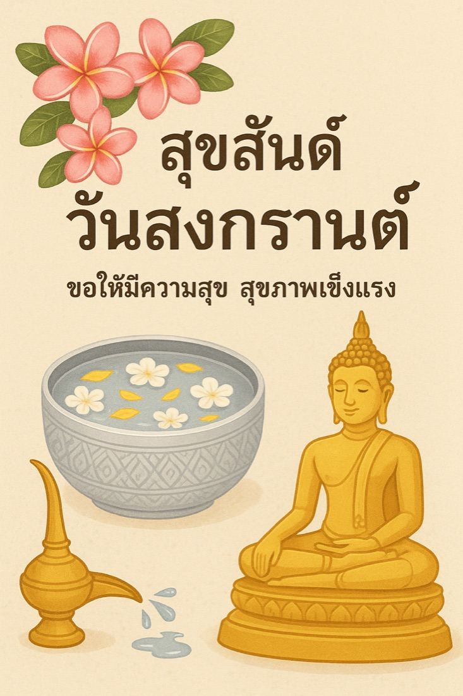
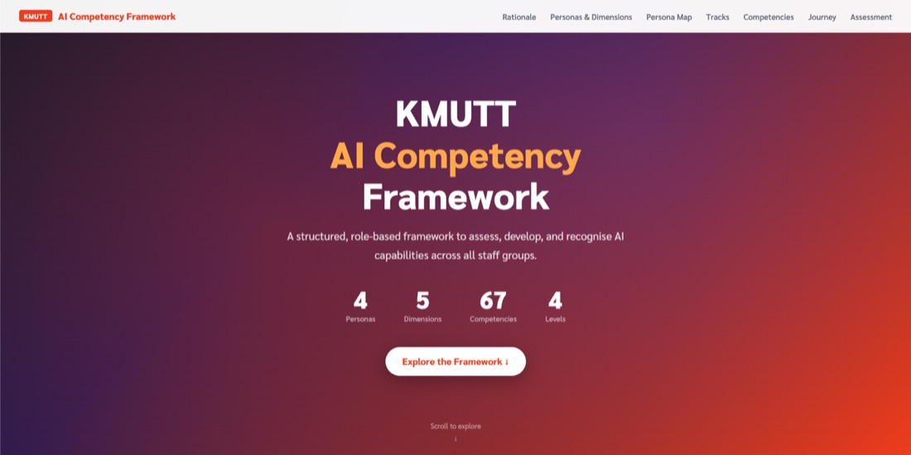
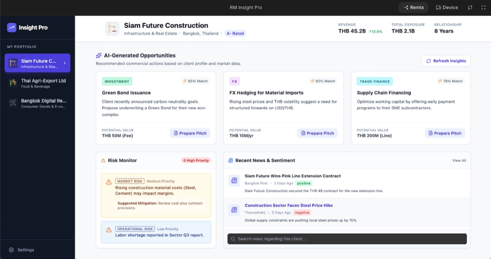

# สร้างชิ้นงานด้วย AI

หน้าสุดท้าย — และเป็นบทสรุปของหลักการที่ใช้มาตลอดทั้ง 7 หน้าก่อนหน้า:

**ไม่ได้เลือกเครื่องมือจากความคุ้นเคย แต่เลือกจากสิ่งที่จะได้ออกมา**

การ์ด · เว็บไซต์ · แอปพลิเคชัน · วิดีโอ — สี่ประเภทงาน สี่เครื่องมือคนละตัว

---

## แบบฝึกหัด: สร้างการ์ดด้วย ChatGPT (5 นาที)

เริ่มจากงานที่ทำได้เร็วที่สุด เปิด [ChatGPT](https://chatgpt.com) แล้วสั่งง่าย ๆ ก่อน:

```prompt
สร้างการ์ดอวยพรวันสงกรานต์ เหมาะสำหรับส่งในไลน์ให้กับผู้ใหญ่
```

<div class="ac-gallery">
  
</div>

**อย่าหยุดที่รอบแรก — สั่งเติมรายละเอียดที่อยากได้:**

```prompt
สร้างการ์ดอวยพรวันสงกรานต์ เหมาะสำหรับส่งในไลน์ให้กับผู้ใหญ่
มีหมาแมวและเด็กๆ เล่นน้ำกันสนุกสนาน
```

<div class="ac-gallery">
  
</div>

!!! tip "ความต่างมาจากคน ไม่ใช่เครื่องมือ"
    ความต่างระหว่างสองภาพนี้ไม่ได้มาจากเครื่องมือที่ดีกว่า แต่มาจาก**คนที่กำกับทิศทางมากขึ้น** — งานสร้างสรรค์ AI ไม่ได้ทำแทนเรา มันทำตามที่เราสั่ง ยิ่งเราเห็นภาพในหัวชัด ยิ่งได้งานตรงใจ

**งานสร้างสรรค์ต่างจากงานเอกสาร:** งานเอกสารยิ่งระบุ spec ละเอียดยิ่งดี — แต่งานภาพ/วิดีโอให้**เริ่มกว้างก่อนแล้วเติมทีละอย่าง** สั่งครบทุกรายละเอียดตั้งแต่รอบแรกมักได้ภาพที่รกและไม่ตรง

**บรรยายสิ่งที่อยากได้ ไม่ใช่สิ่งที่ไม่อยากได้** — "มีเด็กเล่นน้ำสนุกสนาน" ได้ผลดีกว่า "อย่าให้ดูเป็นทางการ"

---

## ดูว่าไปได้ไกลแค่ไหน

### เว็บไซต์ — Claude Code, ~3 ชั่วโมง ไม่เขียนโค้ดเลยสักบรรทัด

<div class="ac-gallery ac-gallery-large">
  
</div>

เว็บไซต์ **KMUTT AI Competency Framework** สร้างด้วย [Claude Code](https://claude.ai/code) โดยการสนทนากับ AI เพื่อออกแบบโครงสร้าง เนื้อหา และดีไซน์ไปพร้อมกัน

### แอปพลิเคชัน — Google AI Studio, 30 วินาที

<div class="ac-gallery ac-gallery-large">
  
</div>

Prototype แอปพลิเคชัน **RM Insight Pro** สร้างด้วย [Google AI Studio](https://aistudio.google.com) ภายใน 30 วินาที ใช้สาธิตให้ผู้บริหารเห็นว่า prototype ไอเดียนวัตกรรมได้เร็วแค่ไหน

### วิดีโอ — ~80 บาทต่อ 15 วินาที

<div class="video-wrapper">
  <iframe src="https://www.youtube.com/embed/BAqJt876a90" frameborder="0" allowfullscreen></iframe>
</div>

วิดีโอสาธิตการใช้ AI สร้างสื่อการเรียนรู้สำหรับพนักงานมหาวิทยาลัย

**เครื่องมือที่ใช้:** Google Cloud TTS (เสียงพากย์ภาษาไทย) + Kling AI (คลิปวิดีโอและ lip sync) + CapCut (ตัดต่อ)

**สังเกตว่าแต่ละงานใช้คนละเครื่องมือ** — ไม่มีตัวไหนทำได้ดีทุกอย่าง และไม่จำเป็นต้องมี

---

## สรุป: เลือกเครื่องมือจากผลลัพธ์ที่ต้องการ

| อยากได้อะไร | เครื่องมือที่เหมาะ | เพราะอะไร |
|---|---|---|
| ข้อความ อีเมล โพสต์ | ChatGPT / Claude / Gemini | งานเขียนล้วน ตัวไหนก็ได้ |
| สรุปจากไฟล์ที่เรามี | NotebookLM | ตอบจาก source เท่านั้น ไม่เดา |
| วิเคราะห์ตัวเลข | Claude (รันโค้ดได้) | คำนวณจริง ไม่ใช่เดาตัวเลข |
| ข้อมูลจากเว็บพร้อมอ้างอิง | Perplexity / Deep Research | ค้นเว็บจริง citation ตรวจได้ |
| ภาพ | ChatGPT Image Generation | สั่งเป็นภาษาธรรมชาติได้ |
| เว็บ / แอป | Claude Code / Google AI Studio | สร้างของที่รันได้จริง |
| วิดีโอ | Kling AI + TTS + ตัดต่อ | งานวิดีโอต้องหลายเครื่องมือต่อกัน |

!!! note "ถามตัวเอง 3 คำถามก่อนเปิดเครื่องมือ"
    1. **งานนี้ต้องการอะไร** — เขียน คำนวณ ค้น หรือสร้าง?
    2. **ข้อมูลที่จะใส่เข้าไปอ่อนไหวแค่ไหน**
    3. **องค์กรอนุมัติเครื่องมือนี้สำหรับข้อมูลระดับนั้นแล้วหรือยัง**

!!! warning "ก่อนนำผลงานไปใช้จริง"
    - **ภาพที่ AI สร้างไม่ได้แปลว่าใช้ได้ทุกที่โดยอัตโนมัติ** — ถ้าจะใช้เชิงพาณิชย์หรือเผยแพร่ภายนอก ให้เช็คเงื่อนไขของเครื่องมือนั้นก่อน
    - **เช็คตัวหนังสือในภาพเสมอ** — AI ยังสะกดผิดในภาพบ่อย โดยเฉพาะภาษาไทย
    - **ถ้าเผยแพร่ภายนอก ควรบอกว่าสร้างด้วย AI** — โดยเฉพาะงานที่คนอาจเข้าใจว่าเป็นภาพถ่ายจริงหรือคนวาดจริง
    - **prototype ไม่ใช่ product** — แอปที่สร้างใน 30 วินาทีใช้สื่อสารไอเดียได้ แต่ยังไม่ผ่านการตรวจความปลอดภัยหรือทดสอบการใช้งานจริง
