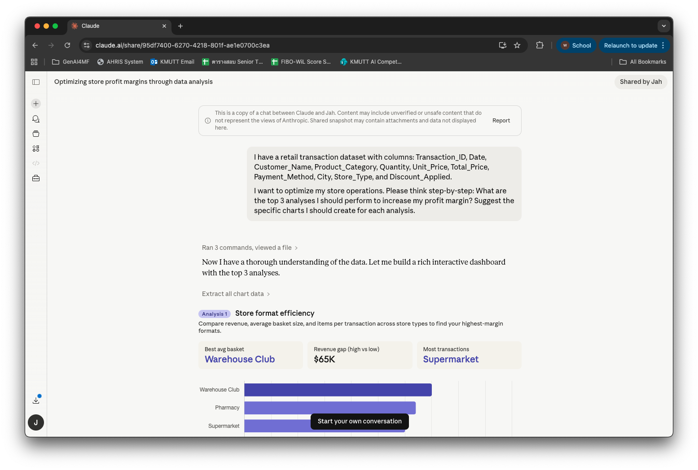
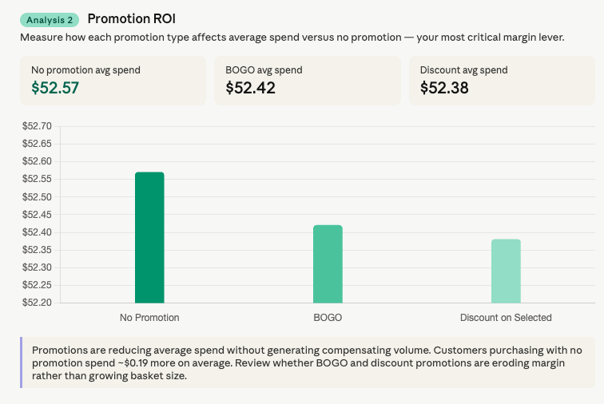

# วิเคราะห์ข้อมูลด้วย AI

อัปโหลดไฟล์ข้อมูล → พิมพ์ prompt → ได้ dashboard แบบ interactive ทันที ไม่ต้องเขียนโค้ด ไม่ต้องรอทีม IT

แต่จุดสำคัญของหน้านี้ไม่ใช่ความเร็ว — คือการทำให้ AI **แสดงวิธีคิดออกมาก่อน** เพื่อให้เราตรวจได้ว่ามันคำนวณถูกจริงไหม

**เครื่องมือที่ใช้:** [Claude](https://claude.ai) — เพราะรันโค้ดวิเคราะห์ได้จริง ไม่ใช่แค่คุยเรื่องข้อมูล

---

## ก่อนเริ่ม: เตรียมไฟล์ให้ปลอดภัย

!!! danger "ก่อนอัปโหลดข้อมูลจริง"
    **ลบคอลัมน์ที่มีชื่อ-นามสกุล เลขบัตรประชาชน เบอร์โทร อีเมล หรือข้อมูลที่ระบุตัวบุคคลออกก่อนเสมอ** — หรือใช้ข้อมูลตัวอย่างในการฝึก

    การรวมข้อมูลที่ดูไม่อ่อนไหวหลายอย่างเข้าด้วยกัน (ชื่อ + ตำแหน่ง + เงินเดือน) อาจกลายเป็นข้อมูลส่วนบุคคลที่ PDPA คุ้มครองได้

!!! warning "ค่าใช้จ่าย"
    งานวิเคราะห์ข้อมูลค่อนข้างเปลือง tokens — ถ้าจะทำเป็นประจำอาจต้องมีงบประมาณซัพพอร์ต

**ข้อมูลตัวอย่างสำหรับฝึก:** [retail transactions dataset จาก Kaggle](https://www.kaggle.com/datasets/prasad22/retail-transactions-dataset) — ดาวน์โหลดมาเล่นได้เลย

---

## แบบฝึกหัดที่ 1: ให้ AI วางแผนวิเคราะห์ก่อน (ยังไม่ให้สรุป)

**สถานการณ์:** คุณมีไฟล์ข้อมูลอยู่ในมือ แต่ยังไม่แน่ใจว่าควรดูอะไรบ้าง

อัปโหลดไฟล์เข้า Claude แล้วใช้ prompt นี้:

```prompt
ฉันมีข้อมูลธุรกรรมร้านค้า มีคอลัมน์ดังนี้: Transaction_ID, Date, Customer_Name,
Product_Category, Quantity, Unit_Price, Total_Price, Payment_Method, City,
Store_Type, Discount_Applied

ฉันต้องการเพิ่มกำไรของร้าน ช่วยคิดทีละขั้น (think step-by-step):
การวิเคราะห์ 3 อย่างแรกที่ฉันควรทำคืออะไร และแต่ละอย่างควรทำกราฟแบบไหน
```

<div class="ac-gallery ac-gallery-large">
  
</div>

!!! tip "ทำไมต้องถาม 'ควรวิเคราะห์อะไร' ก่อนถาม 'ผลเป็นยังไง'"
    ถ้าสั่งให้สรุปเลย AI จะเลือกมุมวิเคราะห์เอง แล้วเราจะไม่รู้ว่ามันมองข้ามอะไร — การให้เสนอแผนก่อนทำให้เราเห็นวิธีคิด และแก้ทิศทางได้ก่อนเสียเวลา

    คำว่า **"think step-by-step"** เป็นเทคนิคที่วงการเรียกว่า *chain-of-thought prompting* ช่วยลดข้อผิดพลาดในงานที่ต้องใช้เหตุผลหลายขั้น และทำให้เราตรวจตามได้

**บอกเป้าหมายทางธุรกิจ ไม่ใช่แค่คำสั่งเทคนิค** — "อยากเพิ่มกำไร" ได้การวิเคราะห์ที่ตรงกว่า "ทำกราฟให้หน่อย"

---

## แบบฝึกหัดที่ 2: ให้รันจริง แล้วตรวจการคำนวณก่อนเชื่อ

เลือกการวิเคราะห์ที่ตรงกับโจทย์จริง แล้วสั่งให้ Claude รันและสร้าง dashboard

```prompt
เอาข้อ [เลือกข้อที่ต้องการ] มาทำจริง โดย:
- รันการวิเคราะห์และสร้างกราฟตามที่เสนอไว้
- แสดงตัวเลขกลางด้วย: ยอดรวมและจำนวนแถวของแต่ละกลุ่ม
- ถ้ามีแถวที่ข้อมูลไม่ครบหรือผิดปกติ ให้บอกว่ามีกี่แถวและจัดการอย่างไร
```

Claude รันโค้ดเอง วิเคราะห์เอง แล้วสร้าง interactive dashboard ให้คลิกดูได้เลย

👉 [ดู Claude Conversation ตัวอย่าง](https://claude.ai/share/95df7400-6270-4218-801f-ae1e0700c3ea) — บทสนทนาเต็มตั้งแต่อัปโหลดไฟล์จนได้ dashboard

<div class="ac-gallery ac-gallery-large">
  
</div>

<div class="ac-gallery ac-gallery-large">
  
</div>

<div class="ac-gallery ac-gallery-large">
  
</div>

### ตรวจ 4 อย่างก่อนเชื่อผลลัพธ์

| ตรวจอะไร | ทำยังไง |
|---|---|
| **ตัวเลขถูกไหม** | เปิดไฟล์ต้นฉบับ sum คอลัมน์เดียวเทียบกับที่ AI บอก — ถ้าตรง ความน่าจะเป็นที่ตัวอื่นถูกก็สูงขึ้นมาก |
| **ใช้ข้อมูลครบไหม** | ดูจำนวนแถวที่ AI ใช้จริง ถ้าไฟล์มี 5,000 แถวแต่ AI วิเคราะห์ 4,800 แถว แปลว่ามีข้อมูลถูกตัดทิ้งโดยไม่บอก |
| **กราฟถูกต้องไหม** | เช็คหน่วย ช่วงแกน และว่าเปรียบเทียบสิ่งที่เทียบกันได้จริงไหม — กราฟสวยแต่แกนผิดพบบ่อย |
| **ข้อสรุปเป็นของใคร** | AI คำนวณถูกไม่ได้แปลว่าตีความถูก การตีความว่า *ทำไม* และ *ควรทำอะไรต่อ* ต้องใช้ความรู้หน้างานที่ AI ไม่มี |

!!! danger "Garbage In Garbage Out"
    ถ้าข้อมูลที่ป้อนไม่ครบ format ไม่สม่ำเสมอ หรือมีแถวซ้ำ **AI จะวิเคราะห์ต่อไปโดยไม่เตือน** — ผลลัพธ์จะดูน่าเชื่อถือทั้งที่ผิดตั้งแต่ต้นทาง

**ถ้าผลไม่ตรงที่คาด ให้ถามกลับว่า "คำนวณจากอะไร"** แทนที่จะสั่งใหม่ทั้งหมด — จะได้เห็นว่าความผิดพลาดอยู่ที่ข้อมูล ที่การตีความโจทย์ หรือที่การคำนวณ

---

## ต่อยอด: วางแผน KPI และ Dashboard ก่อนมีข้อมูล

AI ช่วยได้ตั้งแต่ขั้นวางแผนว่าจะวัดอะไร ไม่ใช่แค่วิเคราะห์ข้อมูลที่มีอยู่แล้ว

```prompt
ฉันเป็น [ตำแหน่ง] ที่ [หน่วยงาน] ดูแล [ขอบเขตงาน]

ข้อมูลที่เรามีอยู่:
1. [ประเภทข้อมูลที่ 1 — เก็บอะไร ความถี่แค่ไหน]
2. [ประเภทข้อมูลที่ 2]
3. [ประเภทข้อมูลที่ 3]

ช่วยคิดทีละขั้น: KPI อะไรบ้างที่เราควรติดตามเพื่อวัด [เป้าหมาย]
และ dashboard ควรมีหน้าตาอย่างไร แสดงอะไรบ้าง
```

---

## สรุป

!!! note "หลักการใช้ให้ถูกต้อง"
    1. **เลือกเครื่องมือที่คำนวณจริง** — chatbot ที่ไม่มี code execution จะให้ตัวเลขที่ดูสมเหตุสมผลแต่ไม่ได้คำนวณจริง
    2. **ให้ AI เสนอแผนก่อน แล้วเราเลือก** — ไม่ปล่อยให้มันตัดสินใจแทนว่าจะดูมุมไหน
    3. **ขอตัวเลขกลาง ไม่ใช่แค่ข้อสรุป** — "แสดงยอดรวมและจำนวนแถวด้วย" ทำให้ตรวจสอบได้
    4. **เช็คตัวเลขอย่างน้อย 1 ตัวด้วยมือเสมอ** — ใช้เวลาไม่ถึงนาที และเป็นการตรวจที่คุ้มที่สุด

!!! warning "สิ่งที่ไม่ควรทำ"
    - **อัปโหลดข้อมูลที่มีชื่อลูกค้า นักศึกษา หรือพนักงาน** เข้าเครื่องมือที่องค์กรยังไม่ได้อนุมัติ
    - **เชื่อ insight โดยไม่เช็คการคำนวณ** — โดยเฉพาะยอดรวมและเปอร์เซ็นต์การเติบโต
    - **มองการตีความของ AI เป็นข้อสรุป** — มันคือจุดเริ่มต้นของดุลยพินิจทางวิชาชีพ ไม่ใช่คำตอบสุดท้าย
