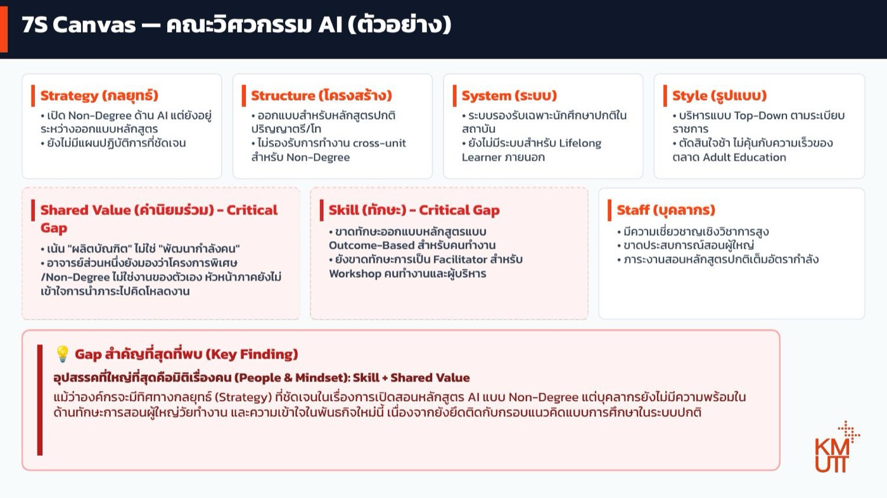

# คิดและตัดสินใจด้วย AI

หน้าอื่น ๆ ในเว็บนี้ใช้ AI **ทำงานให้** — ร่างข้อความ สรุปประชุม ทำสไลด์ วิเคราะห์ข้อมูล อ่านเอกสาร

หน้านี้ต่างออกไป: เราใช้ AI **เป็นคู่คิด** ไม่ใช่คนทำงาน และคำตอบสุดท้ายยังเป็นของเราเสมอ

!!! danger "สิ่งที่คนมักทำผิด"
    ถาม AI ว่า **"ควรทำอะไรดี"** แล้วทำตาม — นั่นคือการโอนการตัดสินใจให้เครื่องมือ ซึ่งรับผิดชอบแทนเราไม่ได้ และไม่รู้ข้อจำกัดด้านงบ นโยบาย หรือการเมืองภายในที่เราไม่ได้บอก

**เครื่องมือที่ใช้:** [Gemini](https://gemini.google.com) หรือ [ChatGPT](https://chatgpt.com) / [Claude](https://claude.ai) — งานนี้ต้องการแค่บทสนทนาที่ลึกและถามกลับได้ ไม่ต้องการเครื่องมือพิเศษ

**ไฟล์ที่ต้องเตรียม:** 📄 [7S-guide.pdf](https://drive.google.com/file/d/1X0y-CV5oziQpwGGKjiM7h8E9VgXfkhEG/view?usp=sharing) — คู่มืออธิบายว่าแต่ละมิติของ 7S คืออะไร ดาวน์โหลดไว้ก่อน

---

## สถานการณ์ที่เราจะใช้ฝึก

**คณะกำลังจะเปิดหลักสูตร Non-Degree ด้าน AI สำหรับคนวัยทำงาน** — ผู้บริหารเห็นชอบทิศทางนี้แล้ว แต่พอจะเริ่มลงมือจริง กลับติดขัดไปหมด

คุณเป็น HR ของคณะนี้ และได้ยินปัญหามาหลากหลาย สิ่งที่ได้ยินจากคนในคณะ:

> *"หลักสูตรยังออกแบบไม่เสร็จเลย ยังไม่รู้ว่าจะเริ่มยังไง · โครงสร้างเวลาเรียนออกแบบไว้สำหรับ ป.ตรี/ป.โท ตารางสอนก็ไม่เอื้ออำนวยให้สอนคนทำงาน · ระบบทะเบียนรองรับแค่นักศึกษาปกติ คนนอกที่อยากมาเรียนลงทะเบียนไม่ได้ · อาจารย์เก่งวิชาการมาก แต่ไม่เคยสอนคนทำงาน · ภาระสอนหลักสูตรปกติก็เต็มอยู่แล้ว · อาจารย์บางส่วนมองว่า Non-Degree ไม่ใช่งานของตัวเอง หัวหน้าภาคก็ยังไม่รู้จะคิดโหลดงานให้ยังไง"*

**คุณต้องเสนอผู้บริหารว่าจะแก้อะไรก่อน** — และปัญหาที่ได้ยินมาทั้งหมดนี้ ปนกันจนแยกไม่ออกว่าอะไรคือสาเหตุ อะไรคือผลที่ตามมา

**สิ่งที่ต้องส่ง:** บทวิเคราะห์หน้าเดียวที่ผู้บริหารอ่านแล้วเห็นภาพว่าอุปสรรคจริงอยู่ตรงไหน และควรลงมือแก้อะไรก่อน

### เริ่มจากกรอบคิด ที่เหมาะสม

เวลาเราสอน HR ให้แก้ปัญหาเชิงกลยุทธ์ เราสอนกรอบแนวคิดก่อน แล้วค่อยสอนวิเคราะห์

สำหรับ AI การให้กรอบคิด ช่วยให้ AI แยกแยะประเด็นได้ดีขึ้น

สำหรับตัวอย่างนี้ เราให้น้อง AI ผู้ช่วย HR ของเราใช้กรอบคิด **McKinsey 7S** คือกรอบวิเคราะห์สุขภาพองค์กรผ่าน 7 มิติที่เชื่อมโยงกัน — จุดประสงค์คือหาว่า **มิติไหนอ่อน หรือมิติไหนไม่สอดคล้องกัน** ไม่ใช่ให้คะแนนว่าดีหรือไม่ดี

| มิติ | คำถามหลักที่ต้องตอบ |
|---|---|
| **Strategy** — กลยุทธ์ | หน่วยงานมีทิศทางชัดไหม คนรู้ไหมว่าจะไปไหน |
| **Structure** — โครงสร้าง | ใครรับผิดชอบอะไร โครงสร้างรองรับงานจริงหรือมีแค่บนกระดาษ |
| **System** — ระบบ | ระบบ IT ข้อมูล และกระบวนการทำงาน ช่วยหรือเป็นอุปสรรค |
| **Staff** — คน | มีคนพอไหม คนที่มีใช่คนที่ต้องการไหม อัตราลาออกเป็นอย่างไร |
| **Skill** — ทักษะ | คนมีทักษะที่งานต้องการไหม ช่องว่างอยู่ตรงไหน |
| **Style** — รูปแบบการบริหาร | ผู้บริหารตัดสินใจแบบไหน วัฒนธรรมการทำงานเป็นอย่างไร |
| **Shared Value** — ค่านิยมร่วม | องค์กรมีค่านิยมที่คนเชื่อจริง หรือมีแค่บนกระดาษ |

**ทำไมต้องมีกรอบ ไม่เล่าปัญหาเปล่า ๆ:** ถ้าเล่าลอย ๆ AI จะสรุปกลับมาเป็นก้อนเดียวตามที่เราเล่า — พอมีกรอบ มันจะแยกให้เห็นว่าปัญหากระจุกอยู่มิติไหน และ**มิติไหนที่เรายังไม่ได้พูดถึงเลย** ซึ่งมักเป็นจุดที่คำตอบซ่อนอยู่

## แบบฝึกหัดที่ 1: สอนกรอบคิดให้ AI ก่อน แล้วระบายปัญหา

### ขั้นตอน

1. **อัปโหลด `7S-guide.pdf` เข้า Gemini ก่อน** — เพื่อให้ AI วิเคราะห์ตามกรอบที่เราเข้าใจตรงกัน ไม่ใช่กรอบที่มันไปหยิบมาจากที่ไหนก็ไม่รู้
2. **เล่าปัญหาตรง ๆ เหมือนคุยกับเพื่อนร่วมงาน ไม่ต้องจัดระเบียบก่อน:**

```prompt
ขอระบายปัญหาในหน่วยงานให้ฟังก่อนนะ:

[พิมพ์หรือพูดได้เลย เช่น "คณะจะเปิดหลักสูตร Non-Degree ด้าน AI สำหรับคนทำงาน
แต่หลักสูตรยังออกแบบไม่เสร็จ โครงสร้างคณะทำไว้สำหรับ ป.ตรี/ป.โท จะทำงานข้ามหน่วยงานก็ติดขัด
ระบบทะเบียนรองรับแค่นักศึกษาปกติ คนนอกลงทะเบียนไม่ได้
อาจารย์เก่งวิชาการแต่ไม่เคยสอนคนทำงาน ภาระสอนปกติก็เต็มแล้ว
อาจารย์บางส่วนมองว่า Non-Degree ไม่ใช่งานของตัวเอง หัวหน้าภาคยังไม่รู้จะคิดโหลดงานยังไง"]

ไฟล์ที่แนบมาคือคู่มืออธิบายว่าแต่ละมิติของ 7S หมายถึงอะไร

ช่วยจัดสิ่งที่ฉันเล่าลงในกรอบ 7S โดย:
- แต่ละมิติเขียนเป็น bullet สั้น ๆ ไม่เกิน 2-3 ข้อ ไม่ต้องเป็นย่อหน้า
- กำกับว่ามิติไหนเป็น Critical Gap และมิติไหนที่ยังพอไปได้
- บอกด้วยว่ามิติไหนที่ฉันยังไม่ได้ให้ข้อมูลเลย
- ยังไม่ต้องสรุป Key Finding ตอนนี้ รอข้อมูลครบก่อน
```

### ผลลัพธ์ที่ได้

<div class="ac-gallery ac-gallery-large">
  
</div>

📄 [เปิดดูไฟล์เต็ม (7s-example.pdf)](7s-example.pdf)

👉 [ดู Gemini Conversation ตัวอย่าง](https://gemini.google.com/share/d/1Dxhn1b6QrAkRwcdQHpAIv3qAXewP01nT?usp=sharing) — บทสนทนาเต็มตั้งแต่อัปโหลดคู่มือจนได้ Canvas

จากเรื่องที่เล่าแบบกระจัดกระจาย AI จัดออกมาเป็นภาพเดียวที่ผู้บริหารกวาดตาอ่านจบได้ — **สังเกต 3 อย่างที่ทำให้มันใช้งานได้จริง:**

| สิ่งที่สังเกตได้ | ทำไมสำคัญ |
|---|---|
| **แต่ละมิติมีแค่ 2–3 bullet สั้น ๆ** | ไม่ใช่เรียงความ — เพราะเราสั่งความยาวไว้ในพรอมต์ ถ้าไม่สั่งจะได้ย่อหน้ายาวที่เอาไปใช้ต่อไม่ได้ |
| **Skill และ Shared Value ถูกกำกับว่า Critical Gap** | ไม่ได้ให้น้ำหนักทุกมิติเท่ากัน แต่ชี้ชัดว่าจุดไหนคือปัญหาจริง |
| **Strategy ไม่ได้ถูกกำกับว่าเป็นปัญหา** | ทิศทางชัดอยู่แล้ว — สิ่งที่ขาดคือความพร้อมของคน ซึ่งเป็นคนละเรื่องกับการไม่มีแผน |

!!! tip "จุดที่การวิเคราะห์แบบมีกรอบให้ผลต่างจากการฟังคำบ่น"
    ถ้าฟังแค่อาการ เราจะได้ข้อสรุปว่า *"ทุกอย่างยังไม่พร้อม"* แล้วแก้ทุกเรื่องพร้อมกัน

    แต่พอจัดลงกรอบแล้วเห็นว่า **ปัญหากระจุกอยู่ที่มิติเรื่องคน (Skill + Shared Value)** ส่วนมิติอื่นเป็นผลที่ตามมา — การแก้จึงเริ่มจากคนละจุด และประหยัดกว่ามาก

### ยิ่งใส่ข้อมูลมาก AI ยิ่งวิเคราะห์แม่น

ผลรอบแรกจะมีมิติที่ AI บอกว่า "ยังไม่มีข้อมูล" — เติมลงไปในบทสนทนาเดิม ลองนึกถึงคำถามเหล่านี้:

| มิติ | คำถามที่ช่วยให้นึกออกว่าควรบอกอะไรเพิ่ม |
|---|---|
| **Staff — คน** | หน่วยงานมีกี่คน? ใครพอจะรับงานใหม่ได้บ้าง? ภาระงานปัจจุบันเต็มแค่ไหน? |
| **Skill — ทักษะ** | คนที่มีอยู่ทำอะไรได้แล้วบ้าง? ทักษะที่ขาดคืออะไรแน่ ๆ? เคยมีใครทำเรื่องนี้มาก่อนไหม? |
| **System — ระบบ** | ระบบที่มีรองรับอะไรได้บ้าง? ถ้าจะปรับต้องคุยกับใคร ใช้เวลานานแค่ไหน? |
| **Structure — โครงสร้าง** | ใครจะเป็นเจ้าภาพเรื่องนี้? ตอนนี้มีใครรับผิดชอบอยู่หรือยัง? |
| **Strategy — กลยุทธ์** | ผู้บริหารตั้งเป้าไว้แค่ไหน? มีกำหนดเวลาไหม? งบมาจากไหน? |
| **Style — การบริหาร** | เรื่องแบบนี้ปกติตัดสินใจกันอย่างไร ใช้เวลานานไหม? |
| **Shared Value — ค่านิยม** | คนในหน่วยงานพูดถึงเรื่องนี้กันว่าอย่างไร? มีใครสนับสนุนเต็มที่บ้าง? |

```prompt
ขอเพิ่มข้อมูลอีกหน่อย:

[ใส่รายละเอียดและตัวเลขถ้ามี เช่น "คณะมีอาจารย์ 24 คน มีคนที่เคยสอนคนทำงานจริง 2 คน
ผู้บริหารตั้งเป้าเปิดรุ่นแรกภาคเรียนหน้า งบยังไม่ได้จัดสรรแยก
ยังไม่มีใครถูกแต่งตั้งเป็นเจ้าภาพอย่างเป็นทางการ"]

ช่วยปรับ 7S Canvas ให้ละเอียดขึ้นตามข้อมูลใหม่นี้
```

!!! tip "สังเกตว่าเรายังไม่ได้ถาม 'ควรทำอะไรดี' เลย"
    ขั้นนี้เราให้ AI **จัดระเบียบสิ่งที่เรารู้** ก่อน เพราะการเห็นปัญหาครบถ้วนคือเงื่อนไขของการตัดสินใจที่ดี

---

## แบบฝึกหัดที่ 2: หาสาเหตุจริง ไม่ใช่แก้ที่อาการ

**ปัญหาที่พบบ่อยที่สุดในการตัดสินใจ: เห็นอาการแล้วแก้ที่อาการ**

| เห็นอาการ | มักแก้ด้วย | แต่ถ้าสาเหตุจริงคือ... |
|---|---|---|
| คนไม่ค่อย engage งานไม่มีคนอาสาทำ | รับคนเพิ่ม | "คนใหม่ไม่มีใครดูแลให้เข้ากับวัฒนธรรม" → รับเพิ่มก็วนซ้ำ |
| ผลงานไม่ดี | จัดอบรม | "ไม่มีเป้าหมายที่ชัดตั้งแต่ต้น" → อบรมเท่าไหร่ก็ไม่ช่วย |
| ข้อมูลไม่ครบ | จ้างทำระบบใหม่ | "ไม่มีคนรับผิดชอบกรอก" → ระบบใหม่ก็ว่างเปล่าเหมือนเดิม |

### ขั้นที่ 1 — ให้วิเคราะห์ผลกระทบจริง ไม่ใช่แค่บอกว่า "ไม่ดี"

```prompt
จากสิ่งที่คุยกันมา ช่วยวิเคราะห์ gap ในแต่ละมิติ โดย:
- ระบุว่า gap แต่ละอันส่งผลอย่างไรในทางปฏิบัติ ไม่ใช่แค่บอกว่าไม่ดี
  แต่บอกว่าทำให้เกิดอะไร หรือทำอะไรไม่ได้
- ถ้า gap ไหนเชื่อมกัน หรือ gap หนึ่งเป็นสาเหตุของอีกอันหนึ่ง ให้บอกด้วย
- จัดลำดับว่าควรแก้อะไรก่อน และเพราะอะไร

จากนั้นเขียนกล่อง "Gap สำคัญที่สุดที่พบ (Key Finding)" ปิดท้าย
โดยสรุปข้ามมิติว่าอุปสรรคใหญ่ที่สุดของหน่วยงานคืออะไร ไม่เกิน 3-4 บรรทัด
```

!!! tip "Key Finding คือส่วนที่ผู้บริหารอ่านจริง"
    ใน Canvas ข้างต้น Key Finding ชี้ว่าอุปสรรคที่ใหญ่ที่สุดคือ **เรื่องคนและ mindset (Skill + Shared Value)** ทั้งที่กลยุทธ์ชัดเจนอยู่แล้ว — ข้อสรุปแบบนี้เปลี่ยนทิศทางการแก้ปัญหาทั้งหมด จากการเร่งออกแบบหลักสูตร มาเป็นการเตรียมคนก่อน

    ถ้าไม่บังคับให้สรุปข้ามมิติ เราจะได้แค่รายการ gap 7 อันที่ดูสำคัญเท่ากันหมด ซึ่งเอาไปตัดสินใจต่อไม่ได้

### ขั้นที่ 2 — เขียน Problem Statement ที่ครบ 3 อย่าง

**Problem Statement ที่ดีบอก 3 อย่าง:** ใครได้รับผลกระทบ · ปัญหาคืออะไรและเกิดจากอะไร (สาเหตุ ไม่ใช่อาการ) · ถ้าไม่แก้จะเกิดอะไร

```prompt
สำหรับแต่ละ gap เขียน Problem Statement 1 ย่อหน้า โดยระบุ:
- ใครได้รับผลกระทบ (ระบุให้ชัด ไม่ใช่แค่ "องค์กร")
- ปัญหาคืออะไร และเกิดจากสาเหตุอะไร (สาเหตุ ไม่ใช่อาการ)
- ถ้าไม่แก้ หน่วยงานจะเจอผลกระทบอะไร

อ้างอิงเฉพาะสิ่งที่ฉันบอกมา ถ้าส่วนไหนข้อมูลยังไม่พอ ให้บอกตรง ๆ ว่าต้องการรู้อะไรเพิ่ม
```

!!! danger "อ่านแล้วเถียงกลับ"
    ข้อไหนที่ AI ให้น้ำหนักผิด หรือมองข้ามไป **บอกให้แก้ได้เลย**

    ถ้าอ่านแล้วเห็นด้วยทุกข้อโดยไม่ต้องแก้อะไร ให้สงสัยไว้ก่อนว่าเราให้ข้อมูลไม่พอ จน AI แค่สะท้อนสิ่งที่เราพูดกลับมา

---

## แบบฝึกหัดที่ 3: ขอทางเลือกและให้ AI หาจุดอ่อนของแผน

```prompt
จาก Problem Statement ที่สรุปกันไว้ ช่วยเสนอทางเลือกในการแก้ 3 ทาง โดยแต่ละทางระบุ:
- ต้องใช้ทรัพยากรอะไรบ้าง (คน เวลา งบ)
- จะเห็นผลเมื่อไหร่
- ข้อเสียหรือความเสี่ยงของทางนี้คืออะไร
- ถ้าทำแล้วไม่ได้ผล จะรู้ได้อย่างไรและเมื่อไหร่

จัดอันดับให้ด้วยว่าทางไหนน่าเริ่มก่อน และเพราะอะไร
```

จากนั้นให้ AI ทำหน้าที่ค้าน:

```prompt
สมมติว่าคุณเป็นผู้บริหารที่ไม่เห็นด้วยกับแผนนี้
ช่วยหาจุดอ่อนของแผนที่เลือกไว้ให้มากที่สุด — ทั้งเรื่องความเป็นไปได้
ผลข้างเคียงที่อาจเกิด และสมมติฐานที่อาจไม่จริง
```

!!! tip "เทคนิคนี้เรียกว่า devil's advocate prompting"
    การให้ AI ค้านแผนของเราเอง เป็นวิธีหาจุดอ่อนที่เราไม่ทันคิดก่อนที่จะไปเจอในห้องประชุมจริง

---

## สรุป

!!! note "หลักการใช้ให้ถูกต้อง"
    1. **สอนกรอบคิดให้ AI ก่อนใช้งาน** — อัปโหลดคู่มือกรอบที่องค์กรเราใช้จริง ป้องกันไม่ให้ AI ไปหยิบนิยามจากที่อื่นที่ไม่ตรงกับที่เราเข้าใจ
    2. **สั่งรูปแบบผลลัพธ์ไปด้วย** — "แต่ละมิติไม่เกิน 2-3 bullet" และ "กำกับว่ามิติไหนเป็น Critical Gap" คือสิ่งที่ทำให้ได้ Canvas หน้าเดียวแทนเรียงความ
    3. **เล่าดิบ ๆ ได้เลย ไม่ต้องเรียบเรียงก่อน** — การจัดระเบียบคืองานของ AI หน้าที่เราคือเล่าให้ครบ
    4. **อย่าถาม "ควรทำอะไรดี" — ถาม "มีทางเลือกอะไรบ้าง แต่ละทางแลกกับอะไร"**
    5. **สั่งให้บอกว่าข้อมูลตรงไหนยังไม่พอ** — ป้องกันการวิเคราะห์บนสมมติฐานที่ AI แต่งขึ้นเอง
    6. **บังคับให้แยกสาเหตุออกจากอาการ** — โดยธรรมชาติ AI จะสรุปสิ่งที่เราเล่า (ซึ่งมักเป็นอาการ) กลับมาให้
    7. **ให้ข้อมูลเป็นตัวเลขเมื่อมี** — "มีอาจารย์ที่เคยสอนคนทำงานจริง 2 คนจาก 24 คน" ให้การวิเคราะห์คนละระดับกับ "อาจารย์ยังไม่พร้อม"

!!! warning "สิ่งที่ไม่ควรทำ"
    - **มองแผนที่ AI ร่างเป็นแผนที่ผ่านการอนุมัติแล้ว** — มันไม่รู้ข้อจำกัดที่เราไม่ได้บอก
    - **ยึดคำตอบแรก** — คำตอบรอบแรกคือจุดเริ่มบทสนทนา ไม่ใช่ข้อสรุป
    - **ปล่อยให้ AI เติมข้อเท็จจริงที่เราไม่เคยบอก** — โดยเฉพาะตัวเลขและชื่อคน อ่านแล้วถามตัวเองว่า "อันนี้ฉันบอกไปหรือเปล่า"
    - **โอนการตัดสินใจให้เครื่องมือ** — AI จัดโครงสร้างตัวเลือกให้ได้ แต่รับผิดชอบผลลัพธ์แทนไม่ได้
