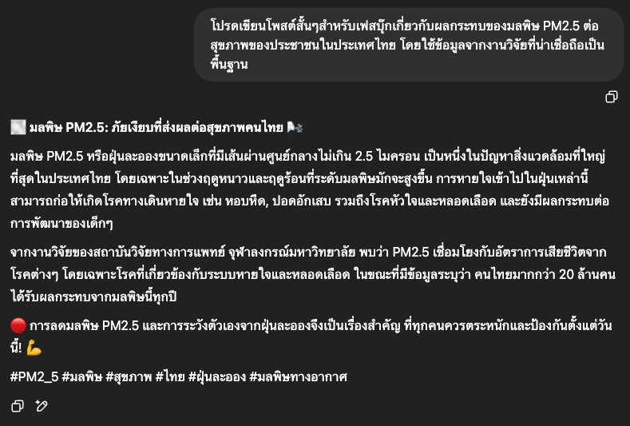
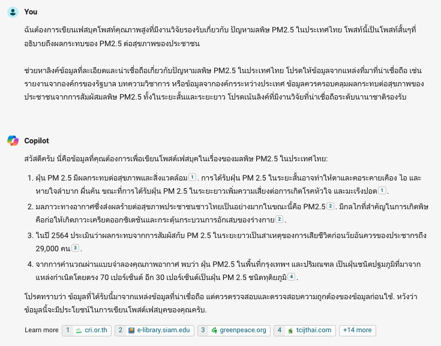

# ร่างข้อความสื่อสารด้วย AI

ในแบบฝึกหัดนี้เราจะสวมบทบาทเป็นเจ้าหน้าที่ที่ได้รับมอบหมายให้เขียนโพสต์เฟซบุ๊กเกี่ยวกับผลกระทบของมลพิษ PM2.5 ต่อสุขภาพคนไทย โดยต้องมีข้อมูลจากงานวิจัยคุณภาพสูงสนับสนุน

เราจะทำ 3 ขั้น: **เตรียมบริบทและวัตถุดิบ → สั่งงานพร้อมเกณฑ์แล้วตรวจ → ระบุรูปแบบผลลัพธ์**

---

## ก่อนเริ่ม: ลองแบบที่คนส่วนใหญ่ทำก่อน

หลายคนเริ่มใช้ AI ด้วยการเขียน prompt สั้น ๆ แล้วคาดหวังผลลัพธ์ที่ดี แต่กลับผิดหวัง จนเข้าใจผิดว่า AI ยังไม่ค่อยฉลาดหรือไม่มีประโยชน์

```
โปรดเขียนโพสต์สั้นๆสำหรับเฟสบุ๊กเกี่ยวกับผลกระทบของมลพิษ PM2.5 ต่อสุขภาพของประชาชนในประเทศไทย โดยใช้ข้อมูลจากงานวิจัยที่น่าเชื่อถือเป็นพื้นฐาน
```




prompt สั้น ๆ ง่าย ๆ มักให้ผลลัพธ์ที่ไม่ค่อยดี เพราะ AI ไม่เข้าใจว่าเราต้องการอะไร และ**ไม่มีแหล่งข้อมูลให้อ้างอิง** จึงมีอาการ hallucinate — เราสั่งให้มัน "ใช้งานวิจัย" แต่ไม่ได้ให้งานวิจัยไป

ลองดูวิธีที่ถูกต้องกัน

---

## แบบฝึกหัดที่ 1: เตรียมบริบทและวัตถุดิบ

ถ้าเราจะทำงานนี้เองและอยากได้ผลลัพธ์คุณภาพสูง เราคงต้องหาข้อมูลที่น่าเชื่อถือก่อน — ให้ AI ทำขั้นนี้ก่อนเช่นกัน **ยังไม่ให้เขียน**

> **Try this prompt**

```
ฉันต้องการเขียนเฟสบุคโพสท์คุณภาพสูงที่มีงานวิจัยรองรับเกี่ยวกับ ปัญหามลพิษ PM2.5 ในประเทศไทย โพสท์นี้เป็นโพสท์สั้นๆที่อธิบายถึงผลกระทบของ PM2.5 ต่อสุขภาพของประชาชน ช่วยหาลิงค์ข้อมูลที่ละเอียดเกี่ยวกับปัญหามลพิษ PM2.5 ในประเทศไทย โปรดให้ข้อมูลจากแหล่งที่มาที่น่าเชื่อถือ เช่น รายงานจากองค์กรของรัฐบาล บทความวิชาการ หรือข้อมูลจากองค์กรระหว่างประเทศ ข้อมูลควรครอบคลุมผลกระทบต่อสุขภาพของประชาชนจากการสัมผัสมลพิษ PM2.5 ทั้งในระยะสั้นและระยะยาว โปรดเน้นลิงค์ที่มีงานวิจัยที่น่าเชื่อถือระดับนานาชาติ
```



งานวิจัยที่ AI หามาได้ค่อนข้างน่าเชื่อถือ — ลิงก์แรกเป็นบทความจากสถาบันวิจัยจุฬาภรณ์ ลิงก์ที่สองเป็นบทความจากอาจารย์คณะเภสัชศาสตร์ มหาวิทยาลัยสยาม

!!! warning "อย่ารับลิงก์ที่ AI ให้โดยไม่คลิก"
    เปิดอ่านทั้งสองแล้วเลือกเอง — ในเดโมนี้บทความที่ 2 ข้อมูลแน่นและน่าเชื่อถือกว่า จึงดาวน์โหลดมาใช้อ้างอิง

📄 [PM2.5 ผลกระทบและกลไกการเกิดพิษ.pdf](pm25-health-effects.pdf) — ตัดหน้าที่ไม่จำเป็นออกแล้วเพื่อให้ใช้กับแผนฟรีได้

---

## แบบฝึกหัดที่ 2: สั่งดึงข้อเท็จจริงพร้อมเกณฑ์ แล้วตรวจก่อนเขียน

เราอยากได้ข้อเท็จจริงจากบทความมาเขียนโพสต์ แต่ขี้เกียจอ่านเอง — จึงให้ AI สรุปเฉพาะข้อเท็จจริงมาให้เราตรวจก่อน **ยังไม่ให้เขียนโพสต์**

!!! tip "เลือกเครื่องมือให้ตรงกับงาน"
    คนที่ใช้ AI หลายตัวจะรู้ว่าแต่ละตัวเก่งคนละอย่าง — งานดึงข้อมูลจาก PDF Claude ทำได้ดีเป็นพิเศษ เราจึงให้ Claude ทำขั้นนี้

> **Try this prompt**

```
ช่วยดึงเอาข้อเท็จจริงมาจากบทความนี้หน่อย อยากได้ข้อเท็จจริงที่เน้นย้ำว่า PM2.5 อันตรายต่อสุขภาพแค่ไหน และอาจจะทำเกิดอาการหรือโรคภัยอะไรกับคนเราได้บ้าง ลิสต์ข้อเท็จจริงทั้งหมดมาและช่วย quote ข้อความในบทความหน่อยว่าแต่ละข้อเท็จจริงมาจากส่วนไหนของบทความนี้ โปรดเขียนให้เข้าใจง่ายๆ คนทั่วไปก็เข้าใจได้ ถ้าใช้คำศัพท์ทางการแพทย์ก็ช่วยวงเล็บอธิบายหน่อยว่าหมายถึงอะไร
```

**สังเกตเกณฑ์ 3 ข้อที่ใส่ไว้ในคำสั่ง:** ลิสต์ให้ครบทุกข้อ · quote ที่มาของแต่ละข้อ · เขียนให้คนทั่วไปเข้าใจ — เกณฑ์เหล่านี้คือสิ่งที่ทำให้ตรวจสอบงานได้

??? note "ผลลัพธ์ที่ได้จาก Claude — ข้อเท็จจริง 11 ข้อพร้อม quote"

    1. **สมรรถภาพปอดลดลง** — "ผลการศึกษาพบว่า PM2.5 ในอากาศมีค่าเฉลี่ย 1.81 ถึง 39.84 ไมโครกรัมต่อลูกบาศก์เมตร (ค่ามัธยฐาน=10.7 ไมโครกรัมต่อลูกบาศก์เมตร) และมีผลลดปริมาตรอากาศที่จุอยู่ในปอด (forced vital capacity) และปริมาตรของอากาศที่เป่าออกอย่างเร็วและแรงในวินาทีที่ 1 (forced expiratory volume in one second)"

    2. **อาการหอบหืด** — "พบว่า PM2.5 กระตุ้นอาการหายใจมีเสียงหวีด (wheezing)"

    3. **โรคปอดอุดกั้นเรื้อรัง** — "พบว่ามีความชุกของโรคปอดอุดกั้นเรื้อรังในกลุ่มที่อาศัยในพื้นที่ที่มี PM2.5 สูงมากกว่ากลุ่มที่อาศัยในพื้นที่ที่มี PM2.5 ต่ำอย่างมีนัยสำคัญ"

    4. **ติดเชื้อทางเดินหายใจส่วนล่าง** — "PM2.5 ที่ความหนาแน่นเกิน 100 ไมโครกรัมต่อลูกบาศก์เมตรมีผลเพิ่มอุบัติการณ์การติดเชื้อในทางเดินหายใจส่วนล่างในเด็กอายุ 0-11 ปี"

    5. **โรคหลอดเลือดหัวใจ** — "ปริมาณของ PM2.5 ที่เพิ่มขึ้น 10 ไมโครกรัมต่อลูกบาศก์เมตรที่ระดับความหนาแน่นมากกว่า 25 ไมโครกรัมต่อลูกบาศก์เมตรจะเพิ่มการเกิดภาวะหัวใจขาดเลือดแบบเฉียบพลัน"

    6. **ความดันโลหิตสูง** — "adjusted hazard ratio ของอุบัติการณ์ในการเกิดโรคความดันโลหิตสูงต่อปริมาณ PM2.5 ที่เพิ่มขึ้นทุกๆ 10 ไมโครกรัมต่อลูกบาศก์เมตรในอากาศมีค่าเท่ากับ 1.13"

    7. **หลอดเลือดแข็งตัว (atherosclerosis)** — "PM2.5 ทำให้ brachial artery flow-mediated dilation หรือ FMD ซึ่งเป็นตัวบ่งชี้การทำงานของเยื่อบุผนังหลอดเลือด (endothelial function) ลดลง"

    8. **ลิ่มเลือดอุดตัน** — "PM2.5 ที่มีความหนาแน่นเพิ่มขึ้น 10 ไมโครกรัมต่อลูกบาศก์เมตรเป็นเวลาเฉลี่ย 1 เดือนมีผลเพิ่มอุบัติการณ์ในการเกิดลิ่มเลือดอุดตันในปอด"

    9. **โรคทางสมองและระบบประสาทส่วนกลาง** — โรคหลอดเลือดสมอง ภาวะสมองเสื่อม กลุ่มอาการออทิสติก และโรคพาร์กินสัน

    10. **เบาหวานชนิดที่ 2** — "เพิ่มความเสี่ยง 1.25 เท่าเมื่อความหนาแน่นของ PM2.5 เพิ่มขึ้น 10 ไมโครกรัมต่อลูกบาศก์เมตร"

    11. **มะเร็งปอด** — "การได้รับ PM2.5 ผ่านทางการหายใจเป็นระยะเวลานานมีความสัมพันธ์กับการเกิดมะเร็งปอดโดยตรง"

!!! danger "ตรวจก่อนไปต่อ"
    เปิด PDF กด `Ctrl+F` / `Cmd+F` ค้นข้อความที่ AI ยกมา **สุ่มเช็ค 2–3 ข้อ** โดยเฉพาะตัวเลข — ถ้าตรงหมด ที่เหลือน่าเชื่อถือขึ้นมาก ถ้าตรวจแล้วถูกต้อง จึงนำไปใช้ในขั้นต่อไปได้

---

## แบบฝึกหัดที่ 3: ระบุรูปแบบผลลัพธ์

ตอนนี้เรามีข้อเท็จจริงที่ตรวจแล้ว เหลือแค่บอกว่าอยากได้งานหน้าตาแบบไหน

> **Try this prompt**

```
โปรดใช้ข้อมูลและข้อเท็จจริงต่อไปนี้ในการเขียนโพสต์สำหรับเฟสบุ๊กขนาดประมาณ 150 คำ โดยใช้หัวข้อประมาณว่า "PM2.5 อันตรายกว่าที่คิด" โพสท์นี้ควรเขียนด้วยภาษาที่คนทั่วไปเข้าใจง่าย พยายามใส่รายละเอียดเท่าที่จะใส่ได้ใน 150 คำ โดยมีโทนของความห่วงใยต่อสุขภาพของผู้อ่าน และแชร์ข้อมูลแบบปรารถนาดีว่าให้ระวังตัวกันด้วย และหาวิธีป้องกันอย่าให้ PM2.5 ทำร้ายเราและคนที่เรารัก อย่าลืมอ้างอิงและขอบคุณผู้วิจัยสั้นๆ ใช้ภาษาที่ฟังดูน่ารัก เป็นกันเอง อบอุ่นแต่น่าเชื่อถือ แทนตัวเองว่าผมและเรียกผู้อ่านว่าลูกค้า เชิญชวนให้อ่านงานวิจัยต่อในลิงค์ (ฉันจะแนบลิงค์ต่อท้ายโพสท์)

---

ต่อไปนี้เป็นข้อเท็จจริงที่สรุปมาจากบทความเรื่อง PM2.5 ผลกระทบต่อสุขภาพและกลไกการเกิดพิษ โดยดร.ภก.วงศกร สุเชาว์อินทร์ คณะเภสัชศาสตร์ มหาวิทยาลัยสยาม

[วางข้อเท็จจริงทั้ง 11 ข้อจากขั้นที่ 2 ที่ตรวจแล้ว]
```

**ห้าอย่างที่ระบุไว้ในคำสั่งนี้:** ความยาว (150 คำ) · ระดับภาษา (คนทั่วไปเข้าใจง่าย) · โทน (ห่วงใย อบอุ่นแต่น่าเชื่อถือ) · สรรพนาม (ผม / ลูกค้า) · สิ่งที่ต้องมี (อ้างอิงผู้วิจัย + เชิญชวนอ่านต่อ)


??? note "ผลลัพธ์จาก Copilot (compose mode)"

    สวัสดีครับลูกค้าที่น่ารักทุกท่าน! วันนี้ผมมีเรื่องสำคัญที่อยากจะแชร์ให้ทุกคนได้รู้กันครับ เรื่องของ PM2.5 ที่อาจจะอันตรายกว่าที่เราคิดกันอยู่นะครับ จากการศึกษาของดร.ภก.วงศกร สุเชาว์อินทร์ พบว่า PM2.5 สามารถทำให้ปอดของเราทำงานได้ไม่เต็มที่ ทำให้เกิดอาการหอบหืด และแม้แต่โรคปอดอุดกั้นเรื้อรังก็เกิดขึ้นได้ครับ นอกจากนี้ยังเพิ่มความเสี่ยงต่อการติดเชื้อในทางเดินหายใจ โรคหลอดเลือดหัวใจ และความดันโลหิตสูงอีกด้วยครับ ดังนั้น อย่าลืมดูแลตัวเองและคนที่เรารักให้ห่างไกลจาก PM2.5 นะครับ และถ้าอยากรู้เพิ่มเติม อย่าลืมติดตามอ่านงานวิจัยของดร.ภก.วงศกร ด้วยนะครับ ขอบคุณครับ! 😊🍃

    

**อ่านออกเสียงหนึ่งรอบก่อนส่ง** — ฟังแล้วเหมือนเราเขียนไหม มีตัวเลขไหนหลุดมาโดยไม่ได้อยู่ในรายการข้อเท็จจริงที่เราอนุมัติหรือเปล่า

---

## สรุป

โพสต์ที่ AI เขียนอาจไม่ได้ดีเลิศที่สุด แต่ถ้าต้องเสิร์ชหาบทความเอง อ่านเอง สรุปเอง เขียนเอง ก็เหนื่อยกว่ามาก — AI เป็นผู้ช่วยที่ทำดราฟท์ให้เราคร่าว ๆ ก่อน แล้วเราแต่งเติมใส่บุคลิกของแบรนด์ลงไปเพิ่ม

**เทียบกับตอนต้นหน้า:** เนื้อหาเดียวกัน หัวข้อเดียวกัน เครื่องมือเดียวกัน — ต่างกันแค่เราให้บริบท ให้ข้อมูลจริง และบอกรูปแบบที่ต้องการ

| ขั้น | สิ่งที่ทำ | เทคนิคหลัก |
|---|---|---|
| 1 | ให้ AI หาแหล่งข้อมูล → เปิดอ่านเอง → เลือกและดาวน์โหลด | **grounding** — ให้ข้อมูลจริงไปด้วย อย่าให้ AI หาเอาเองในหัว |
| 2 | สั่งดึงข้อเท็จจริงพร้อม quote → สุ่มเช็คกับต้นฉบับ | ใส่**เกณฑ์ความสำเร็จ**ลงในคำสั่ง |
| 3 | สั่งเขียนโดยระบุความยาว/ภาษา/โทน/สรรพนาม | ระบุ**รูปแบบผลลัพธ์**ให้ครบ |

!!! warning "ข้อมูลอ่อนไหว"
    เนื้อหาที่ร่างอาจพาดพิงถึงคนหรือหน่วยงาน — อย่าวางข้อมูลลับของบุคคลที่สาม (เช่น อีเมลต้นฉบับจากลูกค้า หรือข้อมูลนักศึกษา) เข้าพรอมต์โดยไม่คิด
