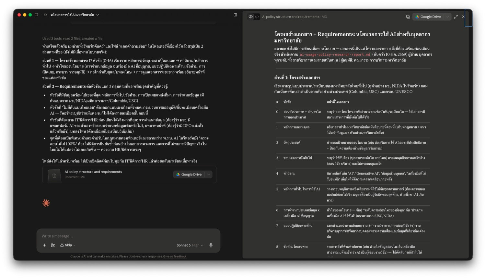

# ร่างเอกสารยาวด้วย AI

**หน้านี้ต่อจาก [ค้นคว้าหาข้อมูล](research.md) โดยตรง** — เรามีรีพอร์ทค้นคว้าเรื่องนโยบายการใช้ AI ของมหาวิทยาลัยไทยอยู่ในมือแล้ว ตอนนี้ต้องแปลงเป็นเอกสารจริงที่ส่งเข้าที่ประชุมได้

งานเขียนที่กินเวลาที่สุดของบุคลากรมหาวิทยาลัย ไม่ใช่อีเมลสั้น ๆ — แต่คือ**เอกสารที่ต้องมีโครงสร้าง มีที่มาที่ไป และมีคนตรวจ** เช่น ระเบียบปฏิบัติ ประกาศ คู่มือ หรือ SOP

---

## สถานการณ์ที่เราจะใช้ฝึก

**คุณต้องร่างนโยบายการใช้ AI สำหรับบุคลากรของมหาวิทยาลัย** จากผลค้นคว้าที่ทำไว้ในหน้าที่แล้ว

📄 **วัตถุดิบที่มีอยู่แล้ว:** [รีพอร์ทค้นคว้า — นโยบายการใช้ AI ของมหาวิทยาลัยไทย](ai-usage-policy-research-report.md)

จากรีพอร์ทนั้นเรารู้แล้วว่า:

- มหาวิทยาลัยไทยอย่างน้อย 4 แห่งออกนโยบายแล้ว (มข., NIDA, มหิดล-รามาฯ, ธรรมศาสตร์-สหเวชฯ) — **มีต้นแบบให้ดู**
- ยังไม่มีกฎหมายเฉพาะเรื่อง AI ในมหาวิทยาลัย มีแต่ PDPA และ พ.ร.บ.คอมพิวเตอร์ที่ครอบคลุมโดยอ้อม — **มีกรอบกฎหมายที่ต้องไม่ขัด**
- บางเรื่องยังยืนยันไม่ได้ และบางเรื่องค้นแล้วไม่พบเลย — **มีช่องว่างที่เราต้องตัดสินใจเอง**

**สิ่งที่ต้องส่ง:** ร่างนโยบายที่มีโครงสร้างครบ + บันทึกนำเสนอผู้บริหาร 2 หน้า

!!! note "เปลี่ยนเป็นเอกสารอื่นก็ใช้ขั้นตอนเดียวกันได้"
    SOP การเดินทางไปปฏิบัติงาน · คู่มือการใช้ห้องปฏิบัติการ · แนวปฏิบัติการจัดซื้อ · ประกาศเรื่องการลา — ทุกอย่างที่ต้อง "มีโครงสร้าง + มีที่มา" ใช้ 3 แบบฝึกหัดนี้ได้หมด

---

## ก่อนเริ่ม: ทำไมงานร่างเอกสารถึงเสี่ยงกว่าที่คิด

ถ้าเปิด AI แล้วพิมพ์ว่า *"ช่วยร่างนโยบายการใช้ AI สำหรับบุคลากรมหาวิทยาลัยให้หน่อย"* — จะได้เอกสารที่**หน้าตาเรียบร้อยมาก** มีหัวข้อครบ มีข้อกำหนดเป็นข้อ ๆ อ้างมาตราของกฎหมาย ระบุบทลงโทษ

**และหลายส่วนในนั้น AI แต่งขึ้นมาเอง** — โดยเฉพาะเลขข้อกฎหมายและชื่อประกาศ

<!-- TODO: ใส่ภาพผลลัพธ์จาก prompt สั้น ๆ ที่ AI แต่งเลขมาตรา/ชื่อประกาศขึ้นมาเอง -->

นี่คือความต่างสำคัญระหว่างงานร่างเอกสารกับงานเขียนทั่วไป — **เอกสารที่ผิดจะกลายเป็นระเบียบที่คนทั้งองค์กรใช้ต่อ** และคนอ่านจะไม่มีทางรู้ว่าข้อไหนมีที่มาจริง ข้อไหน AI เติมให้

| ข้อมูลที่เกี่ยวข้อง | ทำอย่างไร |
|---|---|
| นโยบายของมหาวิทยาลัยอื่นที่เผยแพร่บนเว็บ | อัปโหลดได้ตามปกติ |
| ร่างภายในที่ยังไม่ประกาศ · บันทึกความเห็นจากหน่วยงาน | ใช้บัญชีที่องค์กรจัดให้ |
| ข้อมูลกรณีที่เคยเกิดในองค์กรที่มีชื่อบุคคล | ตัดส่วนที่ระบุตัวบุคคลออกก่อน หรือเล่าเป็นสถานการณ์สมมติ |

---

## แบบฝึกหัดที่ 1: ตั้งโครงเอกสารก่อน — ยังไม่เขียนเนื้อหา

**ขั้นนี้ไม่ได้ขอเนื้อหาเลยสักบรรทัด** — เราขอแค่ 2 อย่าง: โครงสร้างเอกสาร และรายการว่าแต่ละส่วน**ต้องการข้อมูลอะไรถึงจะเขียนได้**

```prompt
จากรีพอร์ทค้นคว้าที่ทำไว้ ฉันต้องร่างนโยบายการใช้ AI สำหรับบุคลากรของมหาวิทยาลัย

คนที่จะอ่าน: บุคลากรทุกระดับ ทั้งสายวิชาการและสายสนับสนุน
คนที่จะอนุมัติ: คณะกรรมการบริหารมหาวิทยาลัย
ข้อจำกัด: ต้องใช้ได้จริงกับบริบทมหาวิทยาลัยไทย ไม่ใช่แค่แปลจากสากล

ขั้นนี้ยังไม่ต้องเขียนเนื้อหา — ขอ 2 อย่างนี้ก่อน:

1. โครงสร้างเอกสาร: นโยบายแบบนี้ควรมีหัวข้ออะไรบ้าง เรียงลำดับอย่างไร
   และแต่ละหัวข้อทำหน้าที่อะไรในเอกสาร

2. Requirements ของแต่ละหัวข้อ: หัวข้อนั้นต้องการข้อมูลอะไรถึงจะเขียนได้จริง แยกเป็น 3 กลุ่ม
   - ข้อมูลไหนที่มีอยู่แล้วในรีพอร์ทค้นคว้า
   - ข้อมูลไหนที่ต้องถามจากหน่วยงานภายใน (IT / นิติการ / ทรัพยากรบุคคล)
   - ข้อมูลไหนที่เป็นการตัดสินใจเชิงนโยบายที่มหาวิทยาลัยต้องกำหนดเอง

ถ้าส่วนไหนไม่มีข้อมูลจริง ให้บอกว่าไม่มี อย่าเติมข้อกำหนดหรือเลขมาตราขึ้นมาเอง
```

### ผลลัพธ์ที่ได้

<div class="ac-gallery ac-gallery-large">
  
</div>

📄 **[เปิดดูไฟล์เต็ม (ai-policy-structure-and-requirements.md)](ai-policy-structure-and-requirements.md)**

ได้โครงเอกสาร **17 หัวข้อ** เรียงจาก หลักการ/วัตถุประสงค์/ขอบเขต → คำนิยาม/หลักการทั่วไป → หัวใจของนโยบาย → กลไกกำกับดูแล/บทลงโทษ พร้อม requirements แยก 3 กลุ่มของทุกหัวข้อ

**สิ่งที่ได้จากขั้นนี้ที่มีค่าที่สุด — รู้ว่าหัวข้อไหนเขียนได้เลย หัวข้อไหนยังเขียนไม่ได้:**

| ประเภทหัวข้อ | ตัวอย่าง | ทำอะไรต่อ |
|---|---|---|
| **ข้อมูลพร้อมใช้ (A) เยอะ** | หลักการทั่วไป · ข้อห้าม · การเปิดเผยแหล่งที่มา | **ร่างได้เลย** |
| **ต้องถามหน่วยงานภายในก่อน (B)** | การจำแนกข้อมูล (ต้องรู้ว่า มจธ. มีระบบชั้นความลับเดิมไหม) · บทบาทหน้าที่ (ต้องรู้ว่ามี DPO แล้วยัง) | **ยังร่างไม่ได้** ต้องไปถามก่อน |
| **ไม่มีต้นแบบไทยเลย** | กระบวนการขออนุมัติ/ขึ้นทะเบียนเครื่องมือ AI | **ต้องออกแบบเอง** |

!!! tip "กลุ่มที่สามคือส่วนที่สำคัญที่สุด"
    **เรื่องที่มหาวิทยาลัยต้องตัดสินใจเอง** — เช่น จะอนุญาตให้ใช้เครื่องมือ AI ตัวไหนบ้าง · จะบังคับให้ระบุการใช้ AI ในงานวิจัยหรือไม่ · จะให้ใช้กับข้อมูลนักศึกษาได้แค่ไหน

    นี่คือส่วนที่ AI ทำแทนไม่ได้และไม่ควรทำแทน ถ้าไม่บังคับให้แยกออกมา มันจะกลืนรวมไปกับข้ออื่นจนเราไม่รู้ว่ากำลังรับนโยบายที่ AI คิดให้

**ตรวจโครงที่ได้ก่อนไปต่อ:** มีหัวข้อไหนที่มหาวิทยาลัยเราต้องมีแต่ AI ไม่ได้ใส่ไหม · มีหัวข้อไหนที่เกินความจำเป็นไหม — แก้ตรงนี้ให้จบก่อน เพราะโครงผิดแล้วเนื้อหาทั้งฉบับผิดตาม

---

## แบบฝึกหัดที่ 2: ร่างทีละหัวข้อไปกับ AI

**เลือกหัวข้อที่ requirements บอกว่าข้อมูลพร้อมแล้วก่อน** — ในเดโมนี้เลือก **"หลักการทั่วไปในการใช้ AI"** (หัวข้อที่ 5) เพราะ requirements ระบุว่ากลุ่ม (A) มีข้อมูลดี (UNESCO + มข. + ธรรมศาสตร์) และกลุ่ม (B) ไม่ต้องถามใครเพิ่ม

!!! warning "อย่าเริ่มจากหัวข้อที่ยังขาดข้อมูล"
    หัวข้อ **"การจำแนกประเภทข้อมูล x เครื่องมือ AI ที่อนุญาต"** ดูเหมือนเป็นหัวใจของนโยบายและน่าเริ่มก่อน — แต่ requirements บอกว่ามันเป็นหัวข้อที่ **(B) สำคัญที่สุดในทั้งเอกสาร** เพราะต้องรู้ก่อนว่า มจธ. มีระบบจำแนกชั้นความลับเดิมอยู่แล้วหรือไม่

    ถ้าดันร่างไปเลย จะได้เอกสารที่ดูดีแต่**อาจสร้างระบบใหม่ซ้อนกับระบบเดิมที่องค์กรมีอยู่** — เสียเวลาทั้งคนร่างและคนตรวจ

### ขั้นที่ 1 — สั่งร่าง โดยล็อกแหล่งข้อมูลให้แคบ

```prompt
ร่างเฉพาะหัวข้อ "หลักการทั่วไปในการใช้ AI" ตามโครงที่วางไว้

ใช้เฉพาะข้อมูลจาก 2 ไฟล์นี้เท่านั้น: รีพอร์ทค้นคว้า และเอกสารโครงสร้าง+requirements
ห้ามเพิ่มหลักการที่ไม่มีที่มาจากสองไฟล์นี้

รูปแบบ:
- เขียนเป็นข้อ ไม่เกิน 6 ข้อ แต่ละข้อไม่เกิน 3 บรรทัด
- ทุกข้อวงเล็บกำกับท้ายว่าอ้างอิงมาจากไหน เช่น (อ้างอิง: UNESCO 2566) หรือ (อ้างอิง: ประกาศ มข. 309/2568)
- ภาษาราชการที่บุคลากรทั่วไปอ่านเข้าใจ ไม่ต้องเป็นทางการจนอ่านยาก

ถ้าข้อไหนเป็นเรื่องที่มหาวิทยาลัยต้องตัดสินใจเอง (กลุ่ม C ใน requirements)
ให้เขียนเป็น "[ต้องตัดสินใจ: ...]" แทนการเขียนล็อกไปเลย
```

**เหตุผลที่ต้องล็อกแหล่งข้อมูลให้แคบ:** ถ้าไม่สั่ง AI จะดึงหลักการ AI ethics ทั่วไปจากความรู้ที่ฝึกมา ซึ่งฟังดูดีมากแต่**ไม่มีที่มาที่เราตามกลับไปได้** และตอนถูกถามในที่ประชุมว่า "ข้อนี้อ้างจากไหน" เราจะตอบไม่ได้

### ขั้นที่ 2 — ยืนยันข้อมูลกับต้นฉบับ ไม่ใช่กับรีพอร์ท

รีพอร์ทค้นคว้าเป็น**การสรุป**ของเอกสารต้นฉบับอีกที — ตอนร่างเอกสารทางการ เราต้องกลับไปดูว่าต้นฉบับเขียนไว้ว่าอย่างไรคำต่อคำ

**วิธีที่เร็วที่สุด:** โหลด PDF นโยบายจากลิงก์ในรีพอร์ท → อัปโหลดเข้า [NotebookLM](https://notebooklm.google.com) ซึ่งตอบจากไฟล์ที่ให้เท่านั้นและมี citation คลิกกลับไปดูตำแหน่งในเอกสารได้

```prompt
เอกสารที่แนบมาคือนโยบายการใช้ AI ของมหาวิทยาลัยไทยหลายแห่ง

ในร่างของฉันเขียนไว้ว่า "[วางข้อที่ร่างไว้]" โดยอ้างอิง [ชื่อเอกสาร]
ช่วยยกข้อความจริงจากเอกสารนั้นมาให้ดู พร้อมระบุว่าอยู่ข้อไหน
ถ้าเอกสารไม่ได้เขียนแบบนั้น ให้บอกตรง ๆ ว่าเขียนไว้ว่าอย่างไรแทน
```

**ตรวจ 3 อย่าง:**

| ตรวจอะไร | ทำยังไง |
|---|---|
| **ข้อความที่อ้างมีจริงไหม** | คลิก citation แล้ว**อ่านย่อหน้ารอบ ๆ ด้วย** — ประโยคที่ยกมาอาจถูก แต่ข้อถัดไปมีเงื่อนไขที่พลิกความหมาย |
| **อ่านครบทั้งฉบับไหม** | ถามถึงเนื้อหาหน้าท้าย ๆ ที่เรารู้ว่ามี ถ้าตอบไม่ได้ = เนื้อหาช่วงท้ายหายไปเงียบ ๆ |
| **มีข้อยกเว้นที่ตกหล่นไหม** | ถามกลับ: "มีข้อยกเว้นหรือเงื่อนไขพิเศษอะไรที่ยังไม่ได้ยกมา" — เอกสารระเบียบซ่อนข้อยกเว้นไว้เสมอ |

### ขั้นที่ 3 — อ่านทบทวนและแก้ดราฟท์ด้วยตัวเอง

**ขั้นนี้ AI ทำแทนไม่ได้** เพราะเราคือคนเดียวที่รู้บริบทของมหาวิทยาลัยเรา

อ่านร่างทีละข้อแล้วถามตัวเอง 4 คำถาม:

1. **ข้อนี้มาจากไหน** — ถ้าตอบไม่ได้ ให้ตัดออกหรือหาที่มาเพิ่ม ไม่ใช่ปล่อยไว้เพราะมันฟังดูดี
2. **ข้อนี้บังคับใช้ได้จริงไหม** — เช่น "ห้ามพึ่งพา AI เกินควร" ฟังดูดีแต่ไม่มีใครรู้ว่าเท่าไหร่คือเกินควร ต้องเขียนให้เป็นรูปธรรมหรือตัดทิ้ง
3. **ข้อนี้ขัดกับระเบียบเดิมของเราไหม** — จริยธรรมวิจัย จรรยาบรรณ ระเบียบ HR ที่มีอยู่แล้ว
4. **ข้อนี้เป็นเรื่องที่ผู้บริหารต้องเลือก ไม่ใช่เราเลือกให้หรือเปล่า** — ถ้าใช่ ต้องเปลี่ยนเป็น `[ต้องตัดสินใจ: ...]`

**แก้เองได้เลย ไม่ต้องสั่ง AI แก้ทุกอย่าง** — การเขียนทับ 2-3 ประโยคด้วยมือเรามักเร็วกว่าและตรงกว่าการอธิบายให้ AI แก้ ให้ใช้ AI ตอนที่ต้องเขียนใหม่ทั้งข้อหรือหาข้อมูลเพิ่มเท่านั้น

!!! tip "ร่างเสร็จหนึ่งหัวข้อแล้ว ทำซ้ำกับหัวข้อถัดไป"
    วนขั้นที่ 1–3 ทีละหัวข้อจนครบเฉพาะหัวข้อที่ข้อมูลพร้อม — ส่วนหัวข้อที่ต้องรอ (B) ให้เว้นไว้เป็น `[รอข้อมูลจาก IT: ...]` แล้วรวบไปถามทีเดียว

---

## แบบฝึกหัดที่ 3: เขียนบันทึกนำเสนอผู้บริหาร

**ร่างนโยบายกับบันทึกนำเสนอเป็นคนละเอกสาร** — ผู้บริหารไม่ได้อ่านนโยบายทั้งฉบับก่อนตัดสินใจ เขาอ่านบันทึก 2 หน้าที่บอกว่าจะให้อนุมัติอะไร

**หน้าที่ของเราในขั้นนี้คือกำกับโครงสร้าง ไม่ใช่ปล่อยให้ AI เรียบเรียงเอง** — เพราะเราคือคนที่อ่านรีพอร์ทและร่างนโยบายมาแล้ว และรู้ว่าอะไรสำคัญต่อผู้บริหารของเรา

```prompt
ช่วยเขียนบันทึกนำเสนอผู้บริหารประกอบร่างนโยบายนี้ ความยาวไม่เกิน 2 หน้า
ตามโครงสร้างนี้:

1. เรื่องที่ขออนุมัติ (ครึ่งหน้า) — ขออนุมัติอะไร และมีทางเลือก 2-3 ทางอะไรบ้าง
   พร้อมข้อดีข้อเสียของแต่ละทาง
2. เหตุผลรองรับ — อ้างอิงจากผลค้นคว้า ทุกข้อมีลิงก์หรือชื่อเอกสารกำกับ
3. ต้นแบบที่ใช้อ้างอิง — เลือกมา 2 แห่ง บอกว่าทำไมเลือกแห่งนั้น และหยิบส่วนไหนมาใช้
4. สิ่งที่ยังไม่รู้และผลกระทบต่อการตัดสินใจ — ถ้าอนุมัติตอนนี้ เสี่ยงตรงไหน
5. ขั้นตอนถัดไป — ใครต้องทำอะไร ภายในเมื่อไหร่

กฎ:
- ใช้เฉพาะข้อมูลจากรีพอร์ทและร่างนโยบาย ห้ามเพิ่มข้อมูลใหม่
- ข้อที่รีพอร์ทระบุว่ายืนยันไม่ได้ ห้ามเขียนเป็นข้อเท็จจริง ให้ใส่ไว้ในข้อ 4 แทน
- ภาษาที่ผู้บริหารอ่านจบใน 5 นาทีแล้วตัดสินใจได้
```

**พรอมต์นี้กำหนด 3 อย่างที่ AI ไม่รู้เอง:**

| สิ่งที่กำหนด | ทำไมต้องกำหนดเอง |
|---|---|
| **โครงสร้าง 5 ส่วน** | AI ไม่รู้ว่าผู้บริหารของเราอยากเห็นอะไรก่อน — ถ้าไม่บอก มันจะเรียงตามลำดับที่ค้นมา ไม่ใช่ลำดับที่ใช้ตัดสินใจ |
| **"เสนอ 2-3 ทางเลือก"** | บันทึกที่มีข้อเสนอเดียวคือการตัดสินใจแทนผู้บริหาร ไม่ใช่การเสนอ |
| **"ข้อที่ยืนยันไม่ได้ ห้ามเขียนเป็นข้อเท็จจริง"** | จุดที่ผิดพลาดง่ายที่สุดตอนย่อ — ⚠️ ในรีพอร์ทมักหายไปตอนเรียบเรียงใหม่ |

### บอกด้วยว่า AI ช่วยตรงไหน

เอกสารที่จะกลายเป็นนโยบายขององค์กร **ควรระบุให้ชัดว่า AI มีบทบาทอย่างไรในการจัดทำ** เช่นในบันทึกนำส่ง:

> *"ร่างฉบับนี้ใช้ AI ช่วยค้นคว้าแนวปฏิบัติจากมหาวิทยาลัยอื่นและจัดโครงสร้างเอกสาร โดยผู้จัดทำได้ตรวจสอบข้อมูลอ้างอิงทุกรายการกับเอกสารต้นฉบับแล้ว"*

!!! tip "การเปิดเผยเสริมความน่าเชื่อถือ ไม่ได้ลดทอน"
    ประโยคแบบนี้บอกผู้อ่านสองอย่างพร้อมกัน: เราทำงานเร็วขึ้นด้วยเครื่องมือใหม่ **และ**เรารับผิดชอบการตรวจสอบเอง — ซึ่งเป็นสิ่งที่ผู้อนุมัติอยากรู้มากกว่าว่าใช้เครื่องมืออะไร

!!! danger "อ่านทั้งฉบับก่อนส่งเสมอ"
    โดยเฉพาะ **ข้อ 2 (เหตุผลรองรับ)** — เช็คว่าทุกข้อยังมีที่มากำกับอยู่ และไม่มีข้อไหนที่ถูกยกระดับจาก "ยืนยันไม่ได้" มาเป็น "ข้อเท็จจริง" ระหว่างการย่อ

---

## บทเรียนปิดท้าย: อ่านทั้งฉบับก่อนเผยแพร่เสมอ

**นี่ไม่ใช่แบบฝึกหัด แต่เป็นขั้นที่ข้ามไม่ได้**

ตลอดสามแบบฝึกหัดข้างต้น เราตรวจงานทีละหัวข้อ — ซึ่งจำเป็น แต่**ไม่พอ** เพราะมีความผิดพลาดบางประเภทที่มองไม่เห็นเลยถ้าอ่านทีละส่วน

### 4 อย่างที่เห็นได้เฉพาะตอนอ่านรวดเดียวทั้งฉบับ

| สิ่งที่ต้องดู | ทำไมต้องอ่านทั้งฉบับถึงเห็น |
|---|---|
| **ข้อขัดกันเอง** | หัวข้อ 5 เขียนว่า "ใช้ AI ได้ตามดุลยพินิจ" แต่หัวข้อ 8 เขียนว่า "ต้องขออนุมัติทุกครั้ง" — แต่ละหัวข้ออ่านแยกกันดูสมเหตุสมผลทั้งคู่ |
| **คำเดียวกันใช้คนละความหมาย** | "เครื่องมือที่ได้รับอนุมัติ" ในหัวข้อ 4 กับหัวข้อ 10 อาจหมายถึงคนละอย่าง เพราะร่างคนละรอบ |
| **น้ำเสียงไม่สม่ำเสมอ** | บางหัวข้อเข้มจนอ่านเหมือนคำสั่งลงโทษ บางหัวข้ออ่อนจนไม่รู้ว่าบังคับหรือแนะนำ |
| **`[รอข้อมูลจาก...]` ที่หลุดรอด** | placeholder ที่ลืมเติมข้อมูล — ถ้าหลุดออกไปเป็นประกาศจริง จะเสียหายมาก |

### วิธีตรวจ

**1. ให้ AI ช่วยหาจุดขัดกันก่อน**

```prompt
นี่คือร่างนโยบายฉบับเต็มที่รวมทุกหัวข้อแล้ว ช่วยตรวจ 4 อย่าง:
1. ข้อไหนขัดกันเองบ้าง — ระบุว่าข้อไหนกับข้อไหน และขัดกันอย่างไร
2. คำศัพท์ไหนที่ใช้ในหลายข้อแต่ความหมายไม่ตรงกัน
3. ข้อไหนที่ยังเป็น placeholder หรือยังไม่มีที่มาอ้างอิง
4. ข้อไหนที่บังคับใช้จริงไม่ได้เพราะเขียนกว้างเกินไป

ยังไม่ต้องแก้ให้ แค่ชี้จุดมาก่อน
```

**2. แล้วอ่านเองทั้งฉบับอีกรอบ** — โดยเฉพาะ 2 จุดที่ AI มักตรวจไม่เจอ:

- **สิ่งที่ควรมีแต่ไม่มี** — AI ตรวจได้แค่สิ่งที่อยู่ในเอกสาร มันไม่รู้ว่าหน่วยงานเราต้องมีข้อกำหนดเรื่องอะไรอีกที่ยังไม่ได้เขียน
- **น้ำเสียงที่ไม่ใช่องค์กรเรา** — เอกสารที่ถูกต้องทุกข้อแต่อ่านแล้วไม่เหมือนที่มหาวิทยาลัยเราสื่อสารตามปกติ จะถูกตีกลับด้วยเหตุผลที่คนตีกลับเองก็อธิบายไม่ถูก

!!! danger "เอกสารที่เผยแพร่แล้วดึงกลับไม่ได้"
    ต่างจากอีเมลที่ส่งผิดแล้วส่งฉบับแก้ตามได้ — **ประกาศหรือระเบียบที่ออกไปแล้วจะถูกอ้างอิงต่อ ถูกแชร์ต่อ และถูกใช้เป็นฐานของเอกสารฉบับอื่น**

    เวลาที่ใช้อ่านทวนทั้งฉบับ 30 นาที ถูกกว่าการออกประกาศแก้ไขทีหลังมาก

---

## สรุป

| ขั้น | สิ่งที่ทำ | เทคนิคหลัก |
|---|---|---|
| 1 | ขอโครงสร้าง + requirements ยังไม่เขียนเนื้อหา | แยก **"ข้อมูลที่มีแล้ว" / "ต้องไปถามใคร" / "นโยบายที่ต้องตัดสินใจเอง"** |
| 2 | ร่างทีละหัวข้อ → ยืนยันกับต้นฉบับ → แก้เอง | เริ่มจากหัวข้อที่ข้อมูลพร้อม ล็อกแหล่งข้อมูลให้แคบ |
| 3 | เขียนบันทึกนำเสนอผู้บริหาร | กำกับโครงสร้างเอง เสนอเป็นทางเลือก ไม่ใช่ล็อกคำตอบ |
| — | **อ่านทั้งฉบับก่อนเผยแพร่** | ข้อขัดกันเองและน้ำเสียงที่ไม่สม่ำเสมอ เห็นได้เฉพาะตอนอ่านรวดเดียว |

!!! note "หลักการที่ใช้ได้กับเอกสารทุกชนิด"
    1. **โครงสร้างก่อนเนื้อหาเสมอ** — เอกสารที่โครงผิด แก้ทีหลังแพงกว่ามาก
    2. **ให้ข้อมูลจริงไปด้วย** อย่าให้ AI หาเอาเองในหัว โดยเฉพาะเรื่องกฎหมายและเลขมาตรา
    3. **สั่งให้เว้นช่องว่างไว้** ดีกว่าปล่อยให้เติมเอง — `[รอข้อมูลจาก...]` เห็นชัดกว่าข้อความที่ดูสมเหตุสมผลแต่ไม่มีที่มา
    4. **ถามหาสิ่งที่ตกหล่น ไม่ใช่แค่ตรวจสิ่งที่ได้มา** — กับเอกสารระเบียบ ความเสียหายมักมาจากข้อยกเว้นที่ไม่ถูกยกมา
    5. **ร่างทีละส่วน** ตรวจได้ทัน แก้ได้ตรงจุด

!!! warning "สิ่งที่ไม่ควรทำ"
    - **สั่งร่างทั้งฉบับรวดเดียวแล้วส่งต่อ** — เอกสารยิ่งเรียบร้อย ยิ่งตรวจยากว่าข้อไหนไม่มีที่มา
    - **ใช้เลขมาตราหรือชื่อประกาศที่ AI เขียนมา** โดยไม่เปิดเอกสารต้นฉบับ
    - **เชื่อว่า AI อ่านครบทั้งเล่ม** — เอกสารยาวเกินขีดจำกัด เนื้อหาช่วงท้ายหายไปโดยไม่มีคำเตือน
    - **ปล่อยให้ AI ตัดสินเรื่องเชิงนโยบายแทนผู้บริหาร** — หน้าที่ของมันคือเสนอทางเลือก ไม่ใช่เลือกให้
    - **ส่งร่างนโยบายให้ผู้บริหารโดยไม่มีบันทึกนำเสนอ** — เขาไม่ได้อ่านทั้งฉบับก่อนตัดสินใจ
    - **เผยแพร่โดยไม่อ่านทวนทั้งฉบับ** — ข้อขัดกันเองมองไม่เห็นตอนตรวจทีละหัวข้อ

---

??? quote "ลิงก์สำหรับอาจารย์เท่านั้น"
    บทสนทนา Claude Cowork ที่ใช้สาธิตหน้านี้ —
    [เปิดดู session](https://claude.ai/cowork/cse_01STvTyJa6KRhe8kEAVEi95c)
