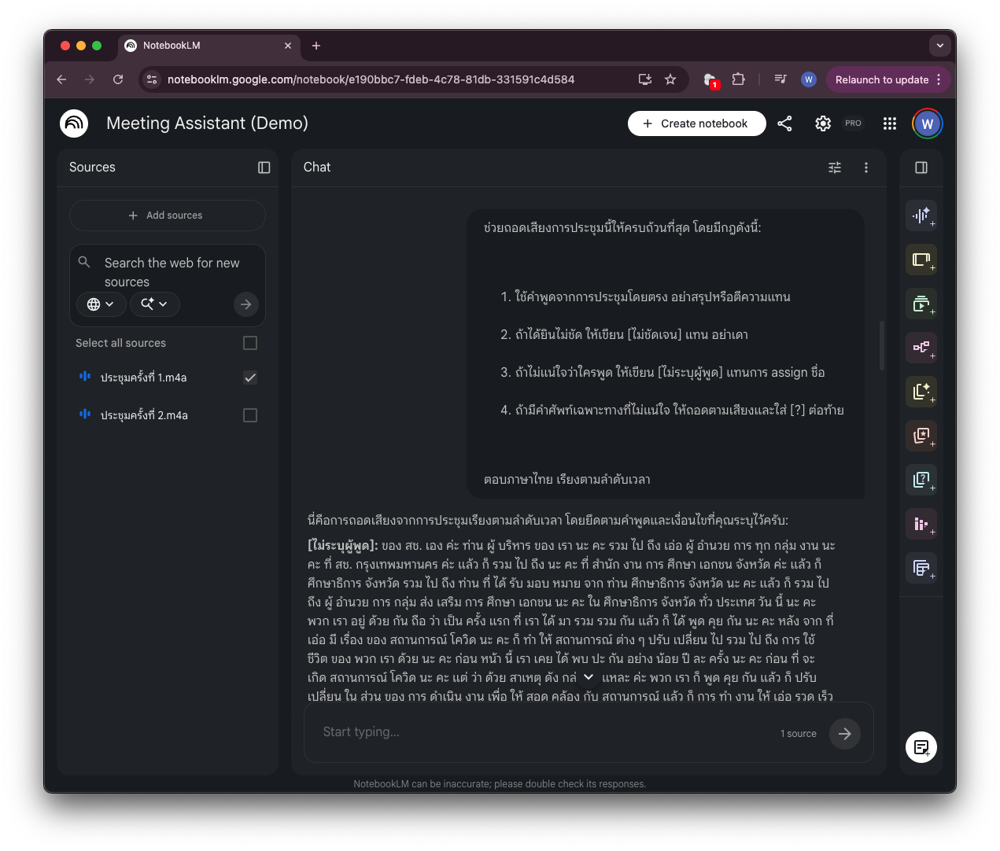
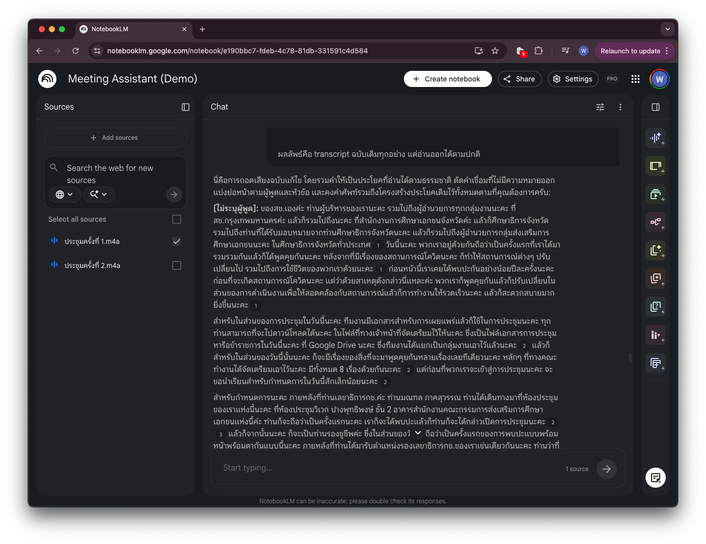
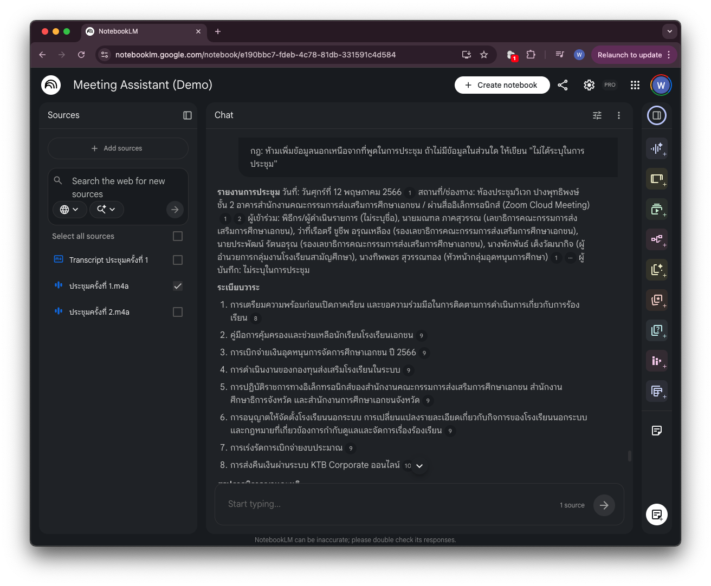

# จัดการบันทึกการประชุมด้วย NotebookLM

ประชุมจบแล้ว แต่งานยังไม่จบ ต้องสรุป action items ส่งทีม ต้องเขียน minutes ให้หัวหน้า ต้องรายงานความคืบหน้าให้ผู้บริหาร — แต่ recording ยาว 1 ชั่วโมง และมีอีก 5 การประชุมที่ยังรอสรุปอยู่

[NotebookLM](https://notebooklm.google.com) เป็นเครื่องมือฟรีจาก Google ที่ออกแบบมาเพื่อสิ่งนี้โดยเฉพาะ — อัปโหลด recording แล้วถามคำถามได้เลย เหมือนมีผู้ช่วยที่ "ฟังการประชุมทุกครั้งมาแล้ว" และจำทุกอย่างได้

หน้านี้จะสอนวิธีใช้ให้ถูกต้อง ตั้งแต่การถอดเสียง ไปจนถึงการรวมหลายประชุมเป็น deliverable เดียวที่ส่งผู้บริหารได้

👉 [ลองเล่น Notebook ตัวอย่างที่เตรียมไว้ให้](https://notebooklm.google.com/notebook/e190bbc7-fdeb-4c78-81db-331591c4d584)

---

## ก่อนเริ่ม (1): เช็คก่อนว่าอัปโหลดได้ไหม

ก่อนอัปโหลดไฟล์ประชุมใด ๆ ให้ถามตัวเองคำถามนี้เสมอ:

**การประชุมนี้มีข้อมูลระดับไหน**

| ระดับ | ตัวอย่าง | ทำอย่างไร |
|---|---|---|
| **สาธารณะ** | ประชุมชี้แจงที่เปิดให้บุคคลภายนอกเข้าฟัง | ใช้บัญชีไหนก็ได้ |
| **ภายใน** | ประชุมทีม ประชุมติดตามงานทั่วไป | ใช้บัญชีที่องค์กรจัดให้ (ผ่าน tenant ขององค์กร) |
| **อ่อนไหว** | ประชุมเรื่องบุคคล ประเมินผลงาน เงินเดือน สัญญา ข้อมูลลูกค้า/นักศึกษา | ใช้เฉพาะเครื่องมือที่องค์กรมีสัญญารองรับข้อมูลระดับนี้ · ถ้ายังไม่ชัดเจน ให้ถามผู้ดูแลระบบก่อน หรือตัดส่วนที่ระบุตัวบุคคลออกก่อนอัปโหลด |

---

## ก่อนเริ่ม (2): NotebookLM ต่างจาก ChatGPT อย่างไร

ทั้งคู่เป็นเครื่องมือดี แต่ออกแบบมาคนละโจทย์ — เลือกให้ตรงกับงานจะได้ผลต่างกันมาก

| | NotebookLM | ChatGPT / Claude / Gemini |
|---|---|---|
| **ตอบจากอะไร** | เอกสารที่เราอัปโหลดเป็นหลัก | ความรู้ที่ฝึกมา + ไฟล์ที่แนบในบทสนทนานั้น |
| **อ้างอิง** | มี citation กำกับ คลิกกลับไปดูตำแหน่งในไฟล์ได้ | ต้องขอเอง และมีโอกาสสร้างแหล่งอ้างอิงที่ไม่มีอยู่จริง |
| **เก็บไฟล์ไว้** | เป็นห้องสมุดถาวร — เปิดกลับมาถามใหม่ได้เรื่อย ๆ | ไฟล์อยู่แค่ในแชทนั้น ขึ้นแชทใหม่ต้องอัปโหลดซ้ำ |
| **ปริมาณที่รับได้** | 50 sources ต่อ notebook · สูงสุด 500,000 คำต่อ source | จำกัดตามความยาวบทสนทนา |
| **ค้นเว็บ** | ไม่ใช่จุดแข็ง — ออกแบบมาให้ยึดกับไฟล์ของเรา | ค้นเว็บสด ๆ ได้ (ดูหน้า [ค้นคว้าหาข้อมูล](research.md)) |
| **ความสามารถทั่วไป** | ไม่ได้ทำมาเพื่อร่างงานใหม่จากศูนย์ | ร่าง เขียน คิด วิเคราะห์ ได้กว้างกว่ามาก |

**สำหรับงานประชุม NotebookLM ชนะชัดเจน** เพราะ 3 อย่าง: recording 1 ชั่วโมงยาวเกินกว่าจะโยนเข้าแชทธรรมดา · คำตอบทุกข้อมี citation ให้ย้อนกลับไปฟังช่วงนั้นได้ · และหลายประชุมสะสมในที่เดียวได้โดยไม่ต้องอัปโหลดซ้ำ

!!! warning "grounded ไม่ได้แปลว่าไม่มีวันผิด"
    การที่มันตอบจากไฟล์ของเราช่วยลดการกุข้อมูลได้มาก **แต่ไม่ได้ทำให้เป็นศูนย์** — โดยเฉพาะเมื่อ:

    - **เสียงไม่ชัด** → มันอาจเติมคำที่ "น่าจะใช่" ลงไป
    - **prompt กว้างเกินไป** → มันสรุปแบบตีความ แทนที่จะยกคำพูดจริง

    วิธีแก้คือสั่งให้ชัดว่า **"ห้ามเดา ถ้าไม่รู้ให้บอก"** ซึ่งเป็นสิ่งที่แบบฝึกหัดที่ 1 จะฝึกกัน

---

## แบบฝึกหัดที่ 1: ถอดเสียงให้แม่น — ป้องกัน hallucination ตั้งแต่ต้น

**สถานการณ์:** คุณอัปโหลด recording การประชุมทีมขึ้น NotebookLM และอยากได้ transcript หรือสรุปที่แม่นยำ ไม่มีการเติมแต่งจาก AI

### ขั้นตอน

1. เข้า [NotebookLM](https://notebooklm.google.com) → สร้าง **New Notebook**
2. กด **+ Add source** → **Upload** → เลือกไฟล์ audio (รองรับ .mp3 .mp4 .wav .m4a) — หาก recording อยู่ในรูปแบบวิดีโอ แนะนำให้แปลงเป็น audio ก่อนเพื่อให้ไฟล์เล็กและจัดการง่าย (ใช้ QuickTime Player บน Mac หรือ VLC Player บน Windows)
3. รอให้ process เสร็จ (ไฟล์ 1 ชั่วโมงใช้เวลาประมาณ 2–3 นาที)
4. **ก่อนถามอะไร ให้บอก context ของการประชุมก่อนเสมอ**

### Step 1 — บอก context ก่อนเริ่ม

วาง prompt นี้เป็นคำถามแรกใน chat:

```prompt
การประชุมนี้คือ การประชุมหารือข้อราชการสำนักงานคณะกรรมการส่งเสริมการศึกษาเอกชน ผ่านสื่ออิเล็กทรอนิกส์ (Zoom Cloud Meeting) ครั้งที่ 1/2566 วันที่ 12 พ.ค. 2566 เวลา 09.30 - 12.00 น. สํานักงานคณะกรรมการส่งเสริมการศึกษาเอกชน OPEC

โปรดรับทราบข้อมูลนี้ก่อนตอบคำถามต่อไป
```

### Step 2 — ขอ transcript แบบที่ป้องกัน hallucination

```prompt
ช่วยถอดเสียงการประชุมนี้ให้ครบถ้วนที่สุด โดยมีกฎดังนี้:

1. ใช้คำพูดจากการประชุมโดยตรง อย่าสรุปหรือตีความแทน
2. ถ้าได้ยินไม่ชัด ให้เขียน [ไม่ชัดเจน] แทน อย่าเดา
3. ถ้าไม่แน่ใจว่าใครพูด ให้เขียน [ไม่ระบุผู้พูด] แทนการ assign ชื่อ
4. ถ้ามีคำศัพท์เฉพาะทางที่ไม่แน่ใจ ให้ถอดตามเสียงและใส่ [?] ต่อท้าย

ตอบภาษาไทย เรียงตามลำดับเวลา
```

### ตัวอย่างผลลัพธ์

<div class="ac-gallery ac-gallery-large">
  
</div>

### Step 3 — ขอให้ AI แก้ไข transcript ให้อ่านได้

บางครั้ง transcript ที่ได้จาก Step 2 จะมีปัญหา **คำแต่ละคำถูกเว้นวรรคแยกออกจากกัน** เช่น:

> `ของ สช. เอง ค่ะ ท่าน ผู้ บริหาร ของ เรา นะ คะ รวม ไป ถึง...`

แทนที่จะเป็น:

> `ของ สช. เองค่ะ ท่านผู้บริหารของเรานะคะ รวมไปถึง...`

ใช้ prompt นี้ให้ AI ทำความสะอาด transcript ก่อนนำไปใช้งานต่อ:

```prompt
transcript ด้านบนมีปัญหา — คำแต่ละคำถูกเว้นวรรคแยกออกจากกันจนอ่านลำบาก

ช่วยแก้ไขโดยมีกฎดังนี้:
1. รวมคำในประโยคเดียวกันให้ติดกันตามธรรมชาติของภาษาไทย เช่น "ท่าน ผู้ บริหาร" → "ท่านผู้บริหาร"
2. ตัดคำที่ไม่มีความหมาย เช่น เอ่อ อ่า ออกจาก transcript ห้ามตัดคำที่อาจจะสื่อความหมายออก
3. คงโครงสร้างประโยคและลำดับเวลาเดิมไว้ทุกอย่าง — ห้ามตัด เพิ่ม หรือสรุปเนื้อหา
4. คง tag เดิมไว้ทุกตัว เช่น [ไม่ระบุผู้พูด] [ไม่ชัดเจน] [?]
5. แบ่งย่อหน้าตามผู้พูดหรือหัวข้อที่เปลี่ยน เพื่อให้อ่านง่ายขึ้น

ผลลัพธ์คือ transcript ฉบับเดิมทุกอย่าง แต่อ่านออกได้ตามปกติ
```

แนะนำให้กด **"Save to Note"** เพื่อจะได้มี transcript ไว้เอาไปใช้ต่อ

### ตัวอย่างผลลัพธ์

<div class="ac-gallery ac-gallery-large">
  
</div>

---

## แบบฝึกหัดที่ 2: สรุปประชุมตาม format ขององค์กรคุณ

**สถานการณ์:** แต่ละองค์กรมี format การเขียน meeting minutes ต่างกัน — บางที่ต้องการแบบทางการมาก บางที่เน้น action items สั้น ๆ บางที่ต้องมีลายมือชื่อผู้อนุมัติ NotebookLM สามารถสรุปตาม template ที่เรากำหนดได้

### ให้ template แล้วให้ fill in

คัดลอก format ด้านล่าง แก้ให้ตรงกับ format ขององค์กรคุณ แล้วส่งให้ NotebookLM:

```prompt
ช่วยสรุปการประชุมตาม format นี้:

---
**รายงานการประชุม**
วันที่: [ใส่วันที่จากการประชุม]
สถานที่/ช่องทาง: [ใส่จากการประชุม]
ผู้เข้าร่วม: [รายชื่อทุกคนที่พูดในการประชุม]
ผู้บันทึก: [ไม่ระบุ]

**ระเบียบวาระ**
[รายการหัวข้อที่คุยกัน]

**สรุปการพิจารณาและมติ**
[สรุปแต่ละวาระ — ใช้คำพูดจากการประชุม ไม่เพิ่มความคิดเห็นเอง]

**Action Items**
| ผู้รับผิดชอบ | งาน | Deadline |
|---|---|---|
| | | |

**เรื่องที่ยังไม่ได้ตัดสินใจ / ต้องติดตาม**
[รายการ]

**การประชุมครั้งต่อไป**
วันที่: [ถ้าระบุในการประชุม]
---

กฎ: ห้ามเพิ่มข้อมูลนอกเหนือจากที่พูดในการประชุม ถ้าไม่มีข้อมูลในส่วนใด ให้เขียน "ไม่ได้ระบุในการประชุม"
```

### ตัวอย่างผลลัพธ์

<div class="ac-gallery ac-gallery-large">
  
</div>

!!! danger "ตรวจก่อนแจกจ่ายเสมอ"
    เทียบ **action items ทุกข้อ** กับต้นฉบับ โดยเฉพาะ **ชื่อคน วันที่ และ deadline** — เมื่อส่งออกไปแล้ว ข้อมูลผิดจะกลายเป็นบันทึกทางการขององค์กร คลิก citation ที่ NotebookLM แสดงเพื่อดูว่าข้อความนั้นมาจากช่วงไหนของการประชุมจริง

---

## แบบฝึกหัดที่ 3: จัดการหลายประชุมในโปรเจกต์เดียว

**สถานการณ์:** คุณดูแลโปรเจกต์ที่ต้องประชุมทุกสัปดาห์ มี recording สะสมอยู่แล้ว 4 ครั้ง และจะมีอีกเรื่อย ๆ คุณอยากให้ AI จำทุกอย่างที่คุยกันมาตลอด และสามารถถามข้ามการประชุมได้

### วิธีตั้งค่า Notebook แบบ Project

1. ตั้งชื่อ Notebook ให้ชัดเจน เช่น **"โปรเจกต์ Digital HR System — 2568"**
2. อัปโหลด recording ทีละไฟล์ โดย **ตั้งชื่อ source** ให้ระบุครั้งและวันที่ เช่น:
    - `ประชุมครั้งที่ 1 — 2 พ.ค. — Kick-off`
    - `ประชุมครั้งที่ 2 — 9 พ.ค. — Requirements`
    - `ประชุมครั้งที่ 3 — 16 พ.ค. — Design Review`
3. เมื่อมีการประชุมใหม่ → เพิ่ม source ใหม่เข้า Notebook เดิม ไม่ต้องสร้างใหม่

ด้วยวิธีนี้ Notebook หนึ่งอันจะเป็น "ห้องเก็บความทรงจำ" ของโปรเจกต์ทั้งหมด

### ถามแบบข้ามหลายการประชุม

```prompt
จากทุกการประชุมที่ผ่านมา ช่วยสรุป:

1. เรื่องอะไรบ้างที่ตัดสินใจแล้วและ action ไปแล้ว?
2. เรื่องอะไรบ้างที่ยังค้างอยู่ หรือถูก defer ออกไป?
3. มี commitment อะไรที่ถูกพูดถึงซ้ำหลายครั้งแต่ยังไม่ได้รับการ assign?

ระบุว่าข้อมูลแต่ละอย่างมาจากการประชุมครั้งที่เท่าไหร่ (อ้างชื่อ source)
```

---

## สรุป: NotebookLM เป็น "memory" ของโปรเจกต์คุณ

!!! note "หลักการใช้ให้ถูกต้อง"
    1. **classify ก่อนอัปโหลดทุกครั้ง** — ประชุมลับไม่ขึ้นเครื่องมือที่ยังไม่ได้รับอนุมัติ
    2. **หนึ่ง Notebook = หนึ่งโปรเจกต์** อย่าผสมหลายโปรเจกต์ใน Notebook เดียว
    3. **ตั้งชื่อ source ให้ชัด** ถ้าชื่อ source คลุมเครือ การอ้างอิงจะผิด
    4. **บอก context ก่อน** แนะนำผู้เข้าร่วมประชุมก่อนถามคำแรก
    5. **ใส่กฎ "ห้ามเดา"** — โดยเฉพาะ prompt ที่เกี่ยวกับ action items และ deadline

!!! warning "สิ่งที่ไม่ควรทำ"
    - **อัปโหลดประชุมที่มีข้อมูล confidential สูง** เช่น ข้อมูลลูกค้า เรื่องบุคคล หรือการประเมินผลงาน — ไฟล์ทั้งหมดอยู่บนเซิร์ฟเวอร์ของ Google
    - **เชื่อสิ่งที่ AI สรุปโดยไม่ตรวจ** — AI จับได้มาก แต่ไม่ครบ โดยเฉพาะงานที่ตกลงกันแบบ "อ้อ แล้วก็..." ตอนท้ายประชุม
    - **ไม่ให้ context ที่เพียงพอ** — ถ้าไม่บอกว่าใครคือใคร การ attribute คำพูดจะผิด และอาจทำให้ action items ถูก assign ผิดคน
