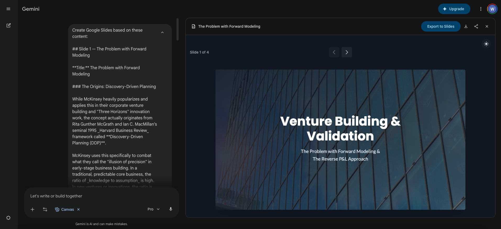
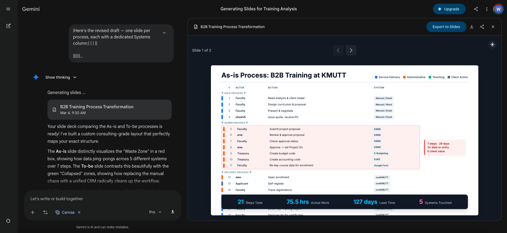

# ตัวอย่างสไลด์ที่สร้างด้วย AI

หน้านี้รวบรวมตัวอย่างสไลด์จริงที่สร้างด้วย pipeline จากหน้า [ทำสไลด์นำเสนอ](presentations.md) — กลั่นเนื้อหาก่อนด้วย ChatGPT หรือ Claude แล้วป้อนเข้า Gemini Canvas

---

## ตัวอย่างที่ 1 — สไลด์วิชาการ: Venture Building & Validation

**บริบท:** สไลด์สำหรับอธิบาย framework การทำ venture building — เนื้อหาซับซ้อน ต้องเล่าเรื่องให้ชัดก่อนออกแบบ ใช้ Claude กลั่น outline ก่อน แล้วป้อนเข้า Gemini Canvas พร้อม brand spec

  

!!! note "สิ่งที่เกิดขึ้นในภาพ"
    ด้านซ้ายคือ Gemini Canvas กำลัง generate สไลด์จาก outline ที่ป้อนเข้าไป — ด้านขวาคือสไลด์ที่ออกมาทันที layout สะอาด title ชัด เนื้อหาไม่ยัด พร้อม export เป็น Google Slides ได้เลย

---

## ตัวอย่างที่ 2 — สไลด์วิเคราะห์กระบวนการ: B2B Training at KMUTT

**บริบท:** สไลด์วิเคราะห์ As-is process ของระบบ B2B Training ที่ KMUTT — ต้องการแสดงให้เห็นว่า "Waste Zone" อยู่ตรงไหน และกระบวนการไหนบ้างที่ยุบรวมได้ ใช้ข้อมูลจริงจากองค์กร ป้อนผ่าน Claude ให้จัดโครงสร้าง แล้วสร้างสไลด์ใน Gemini Canvas

  

!!! note "สิ่งที่เกิดขึ้นในภาพ"
    Gemini Canvas สร้างตาราง process analysis ที่ไฮไลต์ Waste Zone (แดง) และส่วนที่ยุบรวมแล้ว (เขียว) พร้อม summary metrics ด้านล่าง — 21 Apps, 75.3 ชั่วโมง Lead Time, 127 วัน, 5 ระบบที่เชื่อมกัน

    ข้อมูลเชิงลึกแบบนี้ได้มาจากการที่ **AI ช่วยจัดโครงสร้างข้อมูลที่เรามีอยู่แล้ว ไม่ใช่ให้ AI คิดเนื้อหาเอง**
