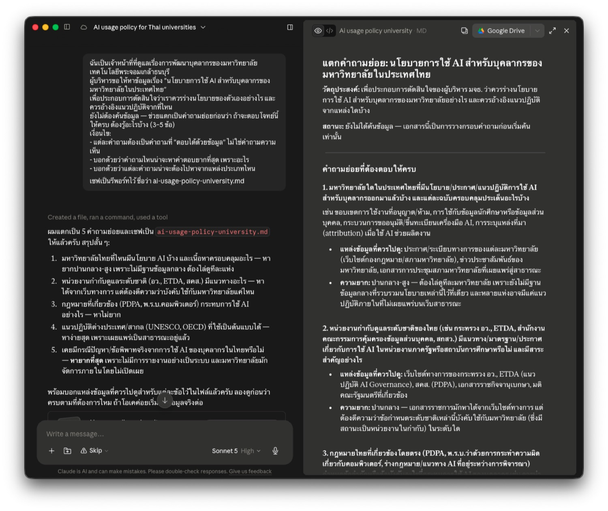

# ค้นคว้าหาข้อมูลด้วย AI

ผู้บริหารสั่งให้ "ไปหาข้อมูลมาหน่อย" — คุณเปิด AI ถามคำถามเดียว ได้คำตอบยาวสวยงามพร้อมลิงก์อ้างอิงครบ ใช้เวลา 3 นาที

**ปัญหาคือคุณไม่รู้เลยว่าในนั้นอะไรเชื่อได้ อะไรเชื่อไม่ได้**

หน้านี้ไม่ได้สอนแค่ "ใช้เครื่องมือไหน" — แต่สอน**วิธีทำงานค้นคว้าให้ผลลัพธ์ปกป้องได้** เมื่อมีคนถามว่า "ข้อมูลนี้มาจากไหน"

!!! danger "ปัญหาที่อันตรายที่สุดไม่ใช่การตอบผิด"
    แต่คือ **การอ้างอิงที่ดูน่าเชื่อถือแต่ไม่มีอยู่จริง** — มีชื่อผู้เขียน มีปีที่ตีพิมพ์ มีเลขหน้า ครบทุกอย่าง ยกเว้นความจริง

    และการสั่ง chatbot ธรรมดาว่า *"ช่วยใส่แหล่งอ้างอิงด้วย"* คือวิธีที่ทำให้เกิดปัญหานี้มากที่สุด เพราะมันจะสร้างสิ่งที่ "ดูเหมือนแหล่งอ้างอิง" ขึ้นมา

---

## ก่อนเริ่ม: เลือกเครื่องมือให้ตรงกับงาน

| | [Perplexity](https://www.perplexity.ai) | Deep Research ([ChatGPT](https://chatgpt.com) / [Gemini](https://gemini.google.com)) | [Claude Cowork](https://claude.ai) |
|---|---|---|---|
| ความเร็ว | ไม่กี่วินาที | 5–30 นาที | ทำงานเป็นขั้น ๆ คุยแก้ระหว่างทางได้ |
| ผลลัพธ์ | คำตอบสั้น + citation ทุกประโยค | รายงานยาว วิเคราะห์เชิงลึก | **ไฟล์เอกสารที่เซฟไว้ใช้ต่อได้** |
| เหมาะกับ | เช็คข้อเท็จจริงเร็ว ๆ ก่อนใส่สไลด์ | งานที่ต้องรายงานครบถ้วนหลายมิติ | งานหลายรอบที่ต้องเก็บผลเป็นเอกสาร |
| ต้องสมัครไหม | ไม่ต้อง | ต้องล็อกอิน | ต้องล็อกอิน |
| โควตาฟรี | ค้นหาไม่จำกัด | ประมาณ 5 ครั้ง/เดือน | ตามแผนที่ใช้ |

**ใช้เสริมกันได้** — Perplexity สำรวจภาพรวมก่อน แล้ว Deep Research หรือ Cowork ลงลึกเมื่อรู้แล้วว่าจะเจาะมุมไหน

!!! tip "ทำไมตัวอย่างในหน้านี้ใช้ Cowork"
    งานค้นคว้าที่ต้องส่งผู้บริหารมัก**ทำไม่จบในรอบเดียว** — แตกคำถาม ค้น แก้ ค้นเพิ่ม แล้วเรียบเรียง

    Cowork เซฟผลแต่ละขั้นเป็น**ไฟล์** ทำให้กลับมาแก้ต่อได้โดยไม่ต้องเริ่มใหม่ และได้เอกสารที่ส่งต่อได้ทันที ต่างจากแชทที่ผลอยู่ในบทสนทนาอย่างเดียว

*(ราคาและโควตาเปลี่ยนบ่อย เช็คหน้าเว็บก่อนใช้จริง)*

---

## แบบฝึกหัดที่ 1: ตั้งคำถามก่อนค้น

**คนส่วนใหญ่เริ่มจากพิมพ์หัวข้อ** — "ขอข้อมูลเรื่อง AI ในมหาวิทยาลัย" แล้วได้บทความกว้าง ๆ ที่เอาไปใช้ตัดสินใจอะไรไม่ได้

**งานค้นคว้าที่ดีเริ่มจากคำถามที่ตอบได้เป็นข้อ ๆ** เพราะคำถามคือสิ่งที่กำหนดว่าเราจะรู้ได้อย่างไรว่า "ค้นเสร็จแล้ว"

### ให้ AI ช่วยแตกคำถามก่อน — ยังไม่ต้องค้น

```prompt
ฉันเป็นเจ้าหน้าที่ที่ดูแลเรื่องการพัฒนาบุคลากรของมหาวิทยาลัยเทคโนโลยีพระจอมเกล้าธนบุรี
ผู้บริหารขอให้หาข้อมูลเรื่อง "นโยบายการใช้ AI สำหรับบุคลากรของมหาวิทยาลัยในประเทศไทย"
เพื่อประกอบการตัดสินใจว่าเราควรร่างนโยบายของตัวเองอย่างไร และควรอ้างอิงแนวปฏิบัติจากที่ไหน

ยังไม่ต้องค้นข้อมูล — ช่วยแตกเป็นคำถามย่อยก่อนว่า
ถ้าจะตอบโจทย์นี้ให้ครบ ต้องรู้อะไรบ้าง (3–5 ข้อ)

เงื่อนไข:
- แต่ละคำถามต้องเป็นคำถามที่ "ตอบได้ด้วยข้อมูล" ไม่ใช่คำถามความเห็น
- บอกด้วยว่าคำถามไหนน่าจะหาคำตอบยากที่สุด เพราะอะไร
- บอกด้วยว่าแต่ละคำถามน่าจะต้องไปหาจากแหล่งประเภทไหน

เซฟเป็นรีพอร์ทไว้ ชื่อว่า ai-usage-policy-university.md
```

### ผลลัพธ์ที่ได้

<div class="ac-gallery ac-gallery-large">
  
</div>

📄 [เปิดดูไฟล์เต็ม (ai-usage-policy-university.md)](ai-usage-policy-university.md)

ได้ออกมา **5 คำถามย่อย** — นโยบายของมหาวิทยาลัยไทยที่ประกาศแล้ว · แนวทางระดับชาติ (อว. / ETDA / สคส.) · กฎหมายที่เกี่ยวข้อง (PDPA, พ.ร.บ.คอมพิวเตอร์) · แนวปฏิบัติต่างประเทศ (UNESCO, OECD) · กรณีปัญหาที่เคยเกิดจริงในไทย

**3 อย่างที่ได้จากขั้นนี้ ซึ่งการค้นรวดเดียวไม่ให้:**

| สิ่งที่ได้ | ทำไมสำคัญ |
|---|---|
| **เห็นมุมที่เราคิดไม่ถึง** | ข้อ 5 (กรณีปัญหาที่เคยเกิดจริง) เป็นมุมที่คนตั้งโจทย์มักลืม แต่เป็นสิ่งที่ผู้บริหารถามแน่นอน |
| **รู้ล่วงหน้าว่าข้อไหนจะหายาก** | ข้อ 5 ถูกระบุว่า**ยากที่สุด** เพราะกรณีแบบนี้ไม่ถูกรายงานอย่างเป็นระบบ และมหาวิทยาลัยมักจัดการภายในโดยไม่เปิดเผย — รู้ตั้งแต่ต้นดีกว่าเสียเวลาค้นแล้วไม่เจอ |
| **รู้ว่าต้องไปหาที่ไหน** | แต่ละข้อระบุประเภทแหล่งไว้แล้ว (ราชกิจจานุเบกษา · เว็บกองกฎหมายมหาวิทยาลัย · เอกสาร UNESCO) ทำให้ขั้นค้นแม่นขึ้นมาก |

!!! tip "ทำไมขั้นนี้คุ้มค่ากว่าที่คิด"
    การมีคำถามเป็นข้อ ๆ ทำให้ **ตรวจได้ว่าคำตอบที่ได้ครบหรือยัง** — ถ้าค้นแบบไม่มีคำถาม เราจะรับสิ่งที่ AI เลือกให้ แล้วไม่มีทางรู้ว่ามันไม่ได้ตอบอะไร

    และเงื่อนไข *"ตอบได้ด้วยข้อมูล ไม่ใช่คำถามความเห็น"* สำคัญมาก — ถ้าไม่สั่ง จะได้คำถามแบบ *"มหาวิทยาลัยควรมีนโยบาย AI หรือไม่"* ซึ่งค้นยังไงก็ไม่เจอคำตอบ เพราะเป็นเรื่องที่เราต้องตัดสินใจเอง

---

## แบบฝึกหัดที่ 2: ค้นให้กว้าง แล้วคัดด้วยเกณฑ์

### ค้นหลายมุม อย่าถามครั้งเดียวจบ

คำถามเดียวได้ผลลัพธ์ชุดเดียว — ลองถามด้วยคำที่ต่างกัน 3–4 รอบ (ภาษาไทย/อังกฤษ · คำทางการ/คำที่คนใช้จริง) จะเจอแหล่งที่รอบแรกไม่ขึ้นมาเลย

```prompt
ช่วยค้นหาข้อมูลเพื่อตอบคำถามทั้งหมดข้างต้น

เงื่อนไข:
- ค้นหลายมุม ทั้งภาษาไทยและภาษาอังกฤษ อย่าค้นรอบเดียวจบ
  แต่ละคำถามควรมีแหล่งข้อมูลประมาณ 3-4 แหล่ง
- อ่าน source อย่างละเอียด ว่าแหล่งข้อมูลเขียนว่าอย่างไรบ้าง
- เรียบเรียงคำตอบให้เข้าใจง่ายตามข้อเท็จจริงที่พบจากการค้นคว้า
  ถ้าข้อไหนหาไม่เจอหรือไม่แน่ใจ ให้บอกตรง ๆ อย่าเดา
- ข้อเท็จจริงทุกข้อต้องมีลิงก์แหล่งอ้างอิงกำกับ
  ที่ฉันสามารถเปิดลิงก์เข้าไปอ่านและตรวจสอบได้ว่าตรงตามนั้น
- แยกให้ชัดว่าอะไรคือข้อเท็จจริงที่มีหลักฐาน กับอะไรคือการคาดการณ์หรือความเห็น

เซฟเป็นรีพอร์ทชื่อว่า ai-usage-policy-research-report.md
```

<!-- TODO: ใส่ภาพรายงานที่ค้นเสร็จแล้ว + ลิงก์ไฟล์ ai-usage-policy-research-report.md -->

**สังเกตว่าเงื่อนไขแต่ละข้อกันคนละอาการ:**

| เงื่อนไข | ป้องกันอะไร |
|---|---|
| *"ค้นหลายมุม ทั้งไทยและอังกฤษ อย่าค้นรอบเดียวจบ"* | ค้นครั้งเดียวแล้วสรุปจากผลหน้าแรก ซึ่งมักได้แหล่งที่ SEO ดี ไม่ใช่แหล่งที่ถูกต้อง |
| *"3-4 แหล่งต่อคำถาม"* | ตอบจากแหล่งเดียวแล้วเขียนให้ดูเหมือนเป็นข้อสรุปที่ยืนยันแล้ว |
| *"อ่าน source อย่างละเอียด"* | สรุปจากหัวข้อหรือ snippet โดยไม่เปิดอ่านเนื้อหาจริง |
| *"แยกข้อเท็จจริงออกจากการคาดการณ์"* | ปนความเห็นเข้ากับข้อมูล จนเราแยกไม่ออกตอนเอาไปเสนอ |

### จัดชั้นแหล่งข้อมูลก่อนเชื่อ

นี่คือทักษะที่ทำให้งานค้นคว้าต่างกันมากที่สุด — **ไม่ใช่ทุกแหล่งมีน้ำหนักเท่ากัน แม้จะพูดเรื่องเดียวกัน**

| ชั้น | ตัวอย่างแหล่ง | ใช้อย่างไร |
|---|---|---|
| **ชั้นหนึ่ง** | งานวิจัยที่ผ่าน peer review · สถิติและเอกสารทางการของหน่วยงานรัฐ · รายงานขององค์กรระหว่างประเทศ (UNESCO, OECD, World Bank) · รายงานสถาบันวิจัยที่เปิดเผยวิธีการเก็บข้อมูล | ใช้อ้างอิงได้เลย |
| **ชั้นสอง** | สื่อคุณภาพที่ทำข่าวเชิงลึก · รายงานอุตสาหกรรมที่บอกวิธีการสำรวจ · preprint ที่ยังไม่ผ่าน peer review | ใช้ได้เมื่อชั้นหนึ่งไม่พอ แต่ควรระบุว่ามาจากไหน |
| **ชั้นสาม** | บล็อกส่วนตัว · โพสต์โซเชียล · เอกสารการตลาดของผู้ขาย · บทความ SEO ที่ไม่มีที่มา | **หลีกเลี่ยง** ถ้าจำเป็นต้องใช้ ต้องบอกให้ชัดว่าเป็นแหล่งประเภทนี้ |

**กฎ 3 ข้อที่ใช้ได้กับทุกแหล่ง:**

1. **ตามกลับไปที่ต้นทางเสมอ** — ข่าวที่สรุปงานวิจัย ไม่เท่ากับตัวงานวิจัย ถ้าจะอ้างตัวเลข ต้องเปิดงานต้นฉบับ
2. **ดูวันที่ทุกครั้ง** — แหล่งที่ไม่ระบุวันที่ ให้ตั้งข้อสงสัยไว้ก่อน ข้อมูลนโยบายและตลาดเก่าเร็วมาก
3. **ดูว่าใครจ่ายเงินให้ทำ** — รายงานที่ผู้ขายเทคโนโลยีทำเอง มักสรุปว่าเทคโนโลยีนั้นคุ้มค่า

!!! warning "เจอบทความที่ดูดีแต่ไม่รู้ว่าใครเขียน"
    ตอนนี้มีบทความจำนวนมากที่ AI สร้างขึ้นเพื่อดันอันดับค้นหา — หน้าตาเรียบร้อย มีตัวเลขเยอะ แต่ไม่มีที่มาและไม่มีคนรับผิดชอบ

    **วิธีสังเกต:** ไม่มีชื่อผู้เขียน · ไม่มีวันที่ · ตัวเลขไม่มีลิงก์กลับไปต้นทาง · ชื่อเว็บไม่คุ้นและไม่ใช่หน่วยงานที่ตรวจสอบได้

### คลิกเปิดทุกลิงก์ที่จะเอาไปใช้

<!-- TODO: ใส่ภาพ Perplexity ที่มี citation กำกับแต่ละประโยค + ภาพตอนคลิกเปิดดูต้นทาง -->

!!! danger "misgrounded citation — อันตรายกว่าการตอบผิดตรง ๆ"
    บางครั้งลิงก์**มีอยู่จริง** เว็บ**เปิดได้จริง** แต่เนื้อหาในนั้น**ไม่ได้พูดสิ่งที่ AI อ้าง**

    อาการนี้อันตรายกว่าการตอบผิดธรรมดา เพราะมันสร้างภาพลวงว่าตรวจสอบแล้ว — ต้องเปิดอ่านย่อหน้านั้นจริงถึงจะรู้

**เช็ค 3 ชั้นตามลำดับ:** ลิงก์เปิดได้ไหม → เนื้อหาตรงกับที่อ้างไหม → เป็นต้นทางหรือเป็นการอ้างต่อ

---

## แบบฝึกหัดที่ 3: เขียนรายงานที่ตรวจสอบได้

รายงานค้นคว้าที่ดีไม่ได้วัดกันที่ความยาว แต่วัดกันที่ **คนอ่านตามรอยกลับไปที่แหล่งได้ทุกข้อ**

```prompt
ช่วยเรียบเรียงข้อมูลที่รวบรวมมาเป็นรายงานสำหรับเสนอผู้บริหาร โครงสร้างดังนี้:

1. คำถามที่ต้องการตอบ — เรียงเป็นข้อ
2. ตารางแหล่งข้อมูล — ชื่อ / ผู้จัดทำ / ปี / ประเภทแหล่ง / ลิงก์
3. สิ่งที่พบ — แยกตามคำถาม ทุกประโยคที่เป็นข้อเท็จจริงต้องมีลิงก์กำกับท้ายประโยค
4. ข้อสรุป — ตอบคำถามแต่ละข้อตรง ๆ เขียนให้คนที่ไม่ได้อ่านส่วนบนเข้าใจได้
5. สิ่งที่ยังไม่รู้ — ข้อมูลส่วนไหนที่หาไม่เจอ ขัดแย้งกัน หรือยังต้องค้นเพิ่ม

กฎ:
- ข้อไหนที่หาแหล่งอ้างอิงยืนยันไม่ได้ ให้ใส่เครื่องหมาย ⚠️ กำกับไว้ ห้ามตัดทิ้งเงียบ ๆ และห้ามเขียนปนกับข้อที่ยืนยันแล้ว
- ห้ามเพิ่มข้อมูลที่ไม่ได้อยู่ในแหล่งที่รวบรวมมา
```

### ทำไม 2 ส่วนสุดท้ายถึงสำคัญที่สุด

| ส่วน | ทำหน้าที่อะไร |
|---|---|
| **⚠️ ข้อที่ยืนยันไม่ได้** | แยกออกมาให้เห็น ดีกว่าตัดทิ้งหรือปล่อยปนไปกับข้อที่ยืนยันแล้ว — คนอ่านจะได้ตัดสินใจเองว่าจะเชื่อแค่ไหน |
| **สิ่งที่ยังไม่รู้** | รายงานที่บอกว่า "เรื่องนี้ยังไม่มีข้อมูล" น่าเชื่อถือกว่ารายงานที่ตอบทุกอย่างได้หมด — และช่วยให้ผู้บริหารรู้ว่าตัดสินใจบนข้อมูลเท่าไหร่ |

!!! tip "ประโยคที่ทำให้รายงานน่าเชื่อถือขึ้นทันที"
    *"ข้อมูลส่วนนี้ยังไม่พบแหล่งอ้างอิงที่ตรวจสอบได้ จึงยังไม่ควรใช้ประกอบการตัดสินใจ"*

    การยอมรับขอบเขตของสิ่งที่รู้ ไม่ได้ทำให้งานดูอ่อน — มันบอกผู้อ่านว่าเราแยกออกระหว่างสิ่งที่รู้กับสิ่งที่เดา

---

## ถ้าใช้ Deep Research: แก้แผนก่อนปล่อยให้รัน

Deep Research จะเสนอ **research plan** ก่อนเริ่มค้น — **อ่านและแก้ตรงนี้** เพราะถ้าปล่อยให้รันผิดทิศ ต้องรอใหม่อีก 5–30 นาที และเสียโควตาไปหนึ่งครั้ง

สิ่งที่ควรดูในแผน: ครอบคลุมคำถามทุกข้อจากแบบฝึกหัดที่ 1 ไหม · จะไปค้นจากแหล่งประเภทไหน · มีมุมไหนที่มันเพิ่มมาเองโดยเราไม่ได้ขอ

**Gemini Deep Research มีข้อได้เปรียบหนึ่งอย่าง** — เชื่อมกับ Google Workspace ได้ ค้นจาก Gmail, Drive และ Chat ของเราประกอบกับข้อมูลจากเว็บได้ในครั้งเดียว และ export เข้า Google Docs ได้ทันที

<!-- TODO: ใส่ภาพหน้า research plan ที่ Deep Research เสนอก่อนเริ่มค้น -->

---

## สรุป

| ขั้น | สิ่งที่ทำ | หลักการ |
|---|---|---|
| 1 | แตกโจทย์เป็นคำถามที่ตอบได้ด้วยข้อมูล | คำถามคือสิ่งที่บอกว่า "ค้นเสร็จแล้ว" |
| 2 | ค้นหลายมุม → จัดชั้นแหล่ง → คลิกเปิดตรวจ | ไม่ใช่ทุกแหล่งมีน้ำหนักเท่ากัน |
| 3 | เขียนรายงานที่มีลิงก์กำกับทุกข้อ + ⚠️ + ช่องว่าง | ตามรอยกลับไปที่แหล่งได้ทุกข้อ |

!!! note "หลักการใช้ให้ถูกต้อง"
    1. **ใช้เครื่องมือที่ citation ติดมาในตัว** — ไม่ใช่ขอ chatbot ธรรมดาให้อ้างอิงเอง
    2. **ระบุกรอบเวลาและขอบเขตพื้นที่** — "ในประเทศไทย ปี 2025–2026" ได้ผลตรงกว่าคำถามลอย ๆ
    3. **บอกว่าจะเอาไปใช้ทำอะไร** — ทำให้ AI เลือกมุมที่ใช้ได้จริง
    4. **สั่งให้แยกข้อเท็จจริงออกจากการคาดการณ์** — สองอย่างนี้ปนกันได้ง่ายมากในรายงานที่ AI เขียน
    5. **สั่งให้บอกความไม่แน่นอน** — "ถ้าหาไม่เจอให้บอกตรง ๆ" ป้องกันการเติมช่องว่าง

!!! warning "สิ่งที่ไม่ควรทำ"
    - **ใช้ตัวเลขหรือ citation โดยไม่คลิกเปิดดู** — โดยเฉพาะสิ่งที่จะขึ้นสไลด์หรือเข้ารายงาน
    - **อ้างข่าวแทนตัวงานวิจัย** — ถ้าจะอ้างตัวเลข ให้ตามไปถึงต้นทาง
    - **ใช้ AI ตรวจ AI** — เอาคำตอบจาก AI ตัวหนึ่งไปถามอีกตัวว่า "จริงไหม" ไม่ใช่การตรวจสอบ ต้องกลับไปที่เอกสารต้นทาง
    - **ตัดข้อที่ยืนยันไม่ได้ทิ้งเงียบ ๆ** — ทำให้รายงานดูแน่นกว่าความจริง ใส่ ⚠️ ไว้ดีกว่า
    - **ส่งรายงานที่ไม่มีส่วน "สิ่งที่ยังไม่รู้"** — ไม่มีงานค้นคว้าไหนที่ตอบได้ทุกอย่าง
